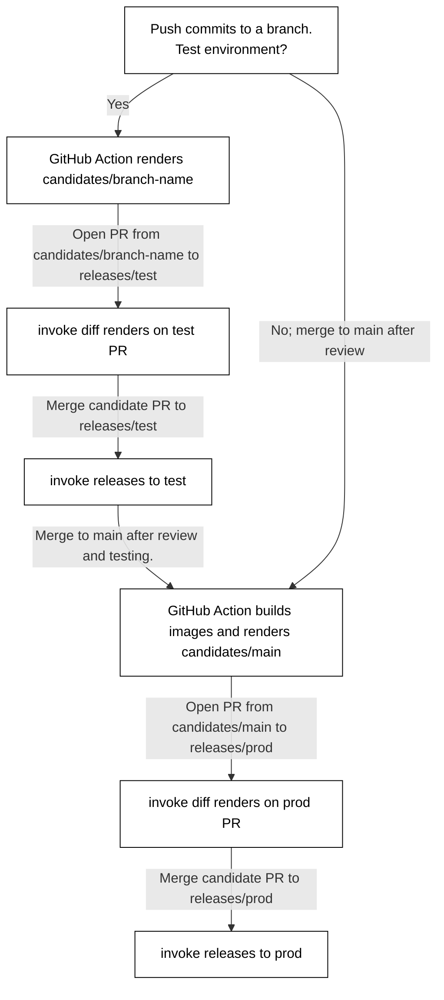

# CI - deploys via pyinvoke

This folder contains code and YAML that drives the deployments of Kubernetes-based applications and services. For example,
a deployment named `archiver` is configured in [the prod channel](./channels/prod.yaml) and is ultimatedly deployed
by `invoke` (see below) calling `kubectl` commands.

## invoke (aka pyinvoke)
[invoke](https://docs.pyinvoke.org/en/stable/) is a Python framework for executing subprocesses and building a CLI application.
The tasks are defined in `tasks.py` and configuration in `invoke.yaml`; config values under the top-level `calitp`
are specific to our defined tasks.

Run `poetry run invoke -l` to list the available commands, and `poetry run invoke -h <command>` to get more detailed help for each individual command.
Individual release channels/environments are config files that are passed to invoke. For example, to deploy to test:

```bash
poetry run invoke release -f channels/test.yaml
```

## GitOps


