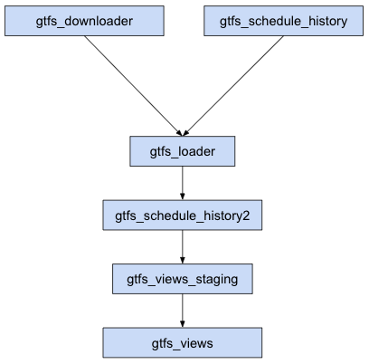

---
jupytext:
  cell_metadata_filter: -all
  formats: md:myst
  text_representation:
    extension: .md
    format_name: myst
    format_version: 0.13
    jupytext_version: 1.10.3
kernelspec:
  display_name: Python 3 (ipykernel)
  language: python
  name: python3
---

# Static Schedule Pipeline

The Static Schedule Pipeline is a collection of the following DAGs

DAG name | DAGs depended on | Run Frequency | Depends on Past DAG runs | Description
--|--|--|--|--
gtfs_downloader | | Daily | No | Downloads static GTFS Feeds
gtfs_schedule_history | | Once | No | Creates datasets for use in BigQuery
gtfs_loader | gtfs_downloader, gtfs_schedule_history | Daily | No | Loads and parses the raw contents of downloaded GTFS Feeds
gtfs_schedule_history2 | gtfs_loader | Daily | Yes | Analyzes the current day's result and creates data about any changes in feed contents
gtfs_views_staging | gtfs_schedule_history2 | Daily | No | Creates staging tables for various view (Dimension and Fact) tables
gtfs_views | gtfs_views_staging | Daily | No | Creates view (Dimension and Fact) tables
