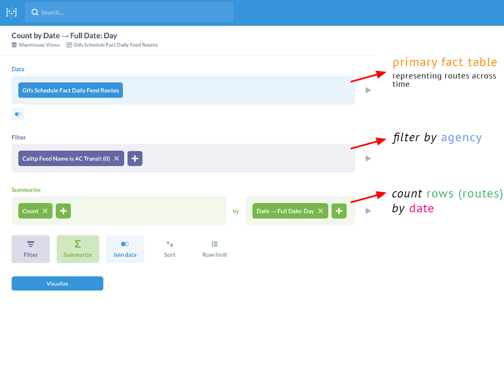
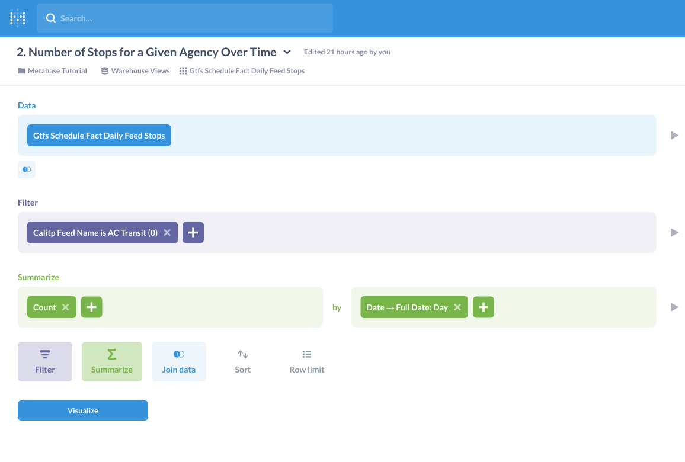
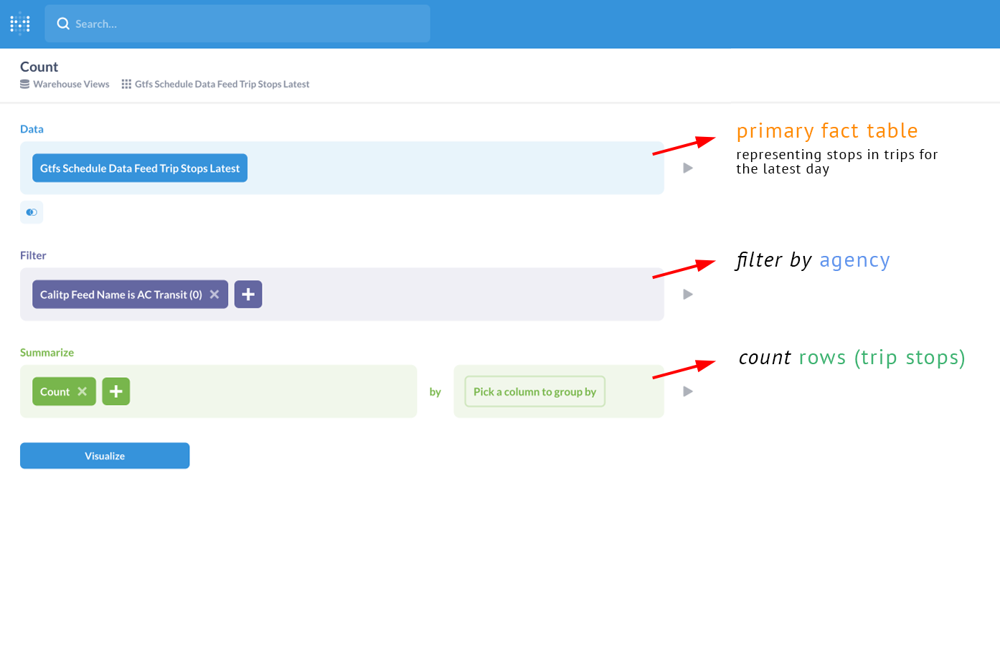
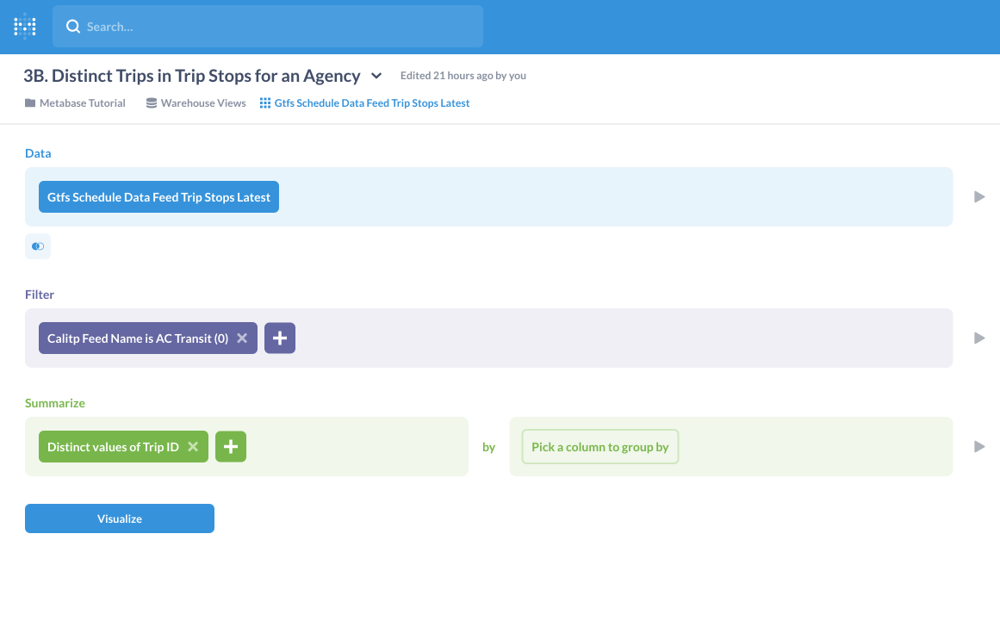
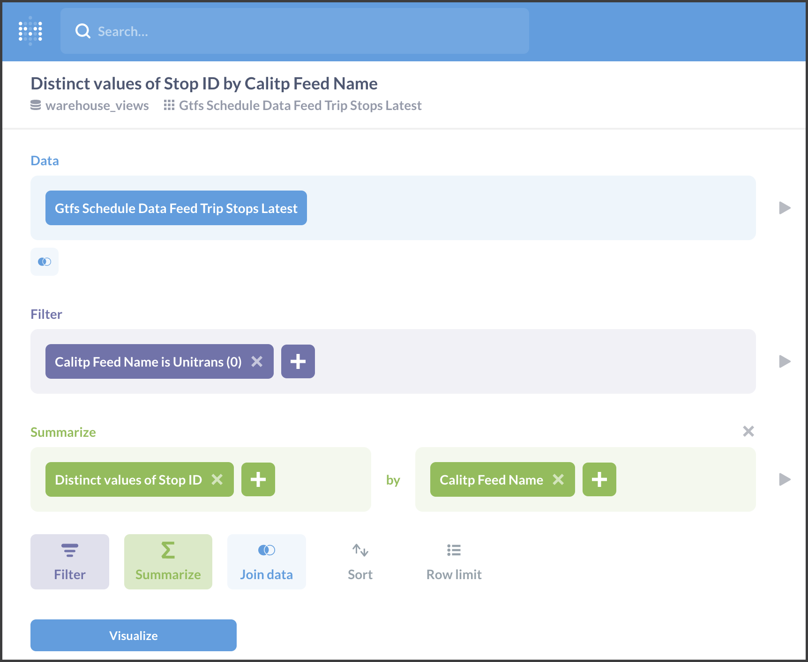
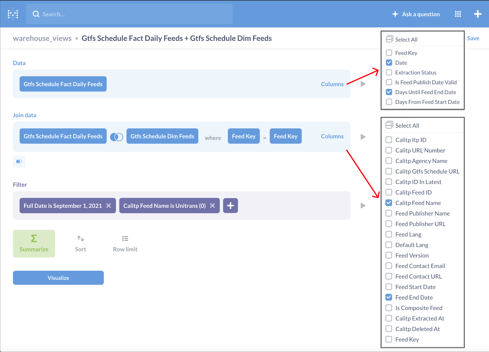
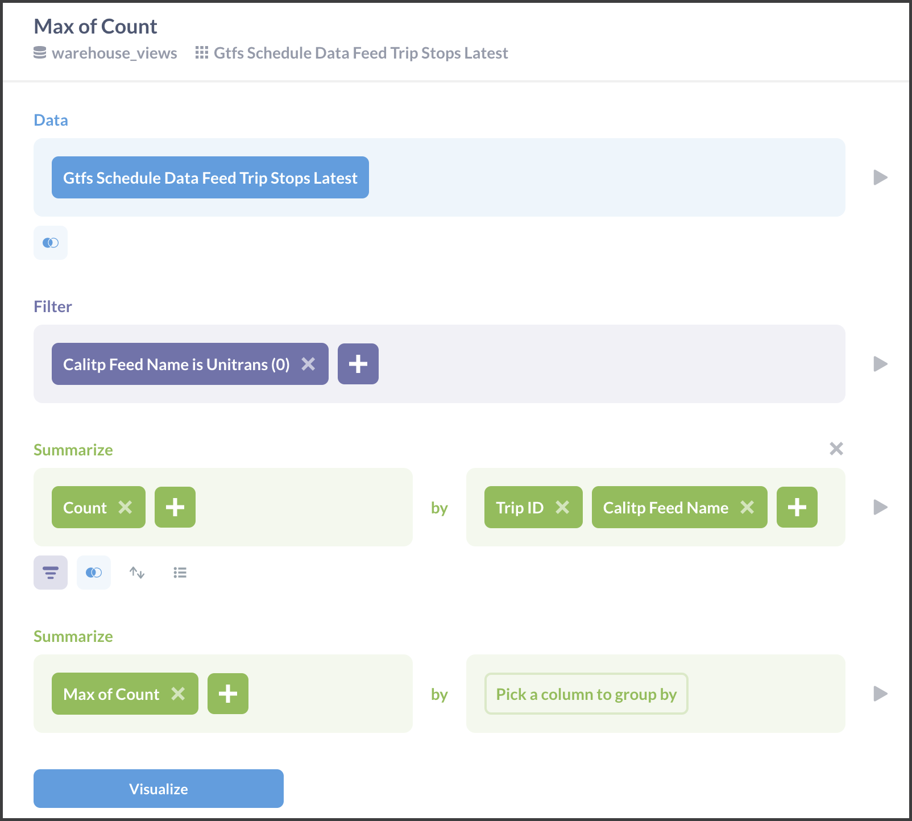

---
jupytext:
  cell_metadata_filter: -all
  formats: md:myst
  text_representation:
    extension: .md
    format_name: myst
    format_version: 0.13
    jupytext_version: 1.10.3
kernelspec:
  display_name: Python 3 (ipykernel)
  language: python
  name: python3
---
(warehouse-tutorial)=
# Tutorial - Querying the Data Warehouse

## Introduction

The following content represents a tutorial introduction to simple queries that can be made to the calitp data warehouse, and the methods that can be used to perform them.

### Example Queries

The queries represented in the following tutorial are as follows:
* [**Number of Routes for a Given Agency Over Time**](routes-agency-time)
* [**Number of Stops for a Given Agency Over Time**](stops-agency-time)
* [**Number of Stops Made Across all Trips for an Agency**](stops-all-trips)
* [**For a Given Agency, on Each Day, Days Until the Feed Expires**](days-feed-expires)
* [**Max Number of Stops a Trip Can Have, Per Agency**](max-number-stops)

### Available Tools

The tools that we can use to answer them are:
* [**Metabase**](metabase) - our business insights and dashboarding tool
* **SQL** - using JupyterHub cloud notebooks
* [**Python**](jupyterhub) - using JupyterHub cloud notebooks
    * *siuba* - a Cal-ITP recommended data analysis library in Python
    * *cal-itp* - Cal-ITP's internal Python library
    * *pandas* - a commonly used data analysis library in Python (used sparsely in the examples below)

### Relevant Tables

````{tabbed} Fact Tables
These tables contain measurements, metrics, and facts used to answer the questions from the following perspectives:

| Table Type | Location |
| -------- | -------- |
| **Feeds** | Warehouse: **views.gtfs_schedule_fact_daily_feeds** <br/> Metabase: **Gtfs Schedule Fact Daily Feeds** |
| **Routes** | Warehouse: **views.gtfs_schedule_fact_daily_feed_routes** <br/> Metabase: **Gtfs Schedule Fact Daily Feed Routes** |
| **Stops** | Warehouse: **views.gtfs_schedule_fact_daily_feed_stops** <br/> Metabase: **Gtfs Schedule Fact Daily Feed Stops** |
| **Trips** | Warehouse: **views.gtfs_schedule_data_feed_trip_stops_latest** <br/> Metabase: **Gtfs Schedule Data Feed Trip Stops Latest** |
````

````{tabbed} Dimensional Tables
These tables compliment the fact tables by providing additional descriptive attributes:

| Table | Location | Description |
| -------- | -------- | -------- |
| **Dim Feeds** | Warehouse: **views.gtfs_schedule_dim_feeds** <br/> Metabase: **Gtfs Schedule Dim Feeds** | - Joining with this table is the most common way to append calitp_feed_name to fact tables <br/> - calitp_feed_name is our primary agency identifier |
````

### Important Column Types

| Column Type | Notable Columns | Description |
| -------- | -------- | -------- |
| **Agency** | Warehouse: **calitp_feed_name** <br/> Metabase: **Calitp Feed Name** | - Our primary agency identifier <br/> - In most of the examples below, this is gathered from the table: **views.gtfs_schedule_dim_feeds** <br/> - Metabase: **Gtfs Schedule Dim Feeds** |
| **Time** | | |
| **Geography** | | |

### Python Libraries to Import

```{code-cell}
from calitp.tables import tbl
from calitp import query_sql
from siuba import *
import pandas as pd
import calitp.magics
pd.set_option("display.max_rows", 20)
```

```{code-cell}
:tags: [remove-cell]
from myst_nb import glue
```

## Query Examples

(routes-agency-time)=
### 1. Number of Routes for a Given Agency Over Time

```{code-cell}
:tags: [remove-cell]
df_routes = query_sql("""
SELECT
    calitp_feed_name,
    date,
    count(*) AS count_feeds
FROM `views.gtfs_schedule_fact_daily_feed_routes`
JOIN `views.gtfs_schedule_dim_feeds` USING (feed_key)
WHERE
    calitp_feed_name = "Unitrans (0)"
GROUP BY
    1, 2
ORDER BY
    date DESC
LIMIT 10""", as_df=True)
glue("df_routes_output", df_routes)
```

```{code-cell}
:tags: [remove-cell]
siuba_routes = (
    tbl.views.gtfs_schedule_fact_daily_feed_routes()
    >> left_join(_, tbl.views.gtfs_schedule_dim_feeds(), "feed_key")
    >> filter(_.calitp_feed_name == "Unitrans (0)")
    >> count(_.date)
    >> arrange(_.date)
)

glue("siuba_routes_output", siuba_routes)
```

````{tabbed} Metabase
**Tables Used**
| Name | Use |
| -------- | -------- |
| **Gtfs Schedule Fact Daily Feed Routes** | Primary Fact Table |
| **Gtfs Schedule Dim Feeds** | Secondary Dimensional Table |

**Important Columns**
| Type | Column | Use |
| -------- | -------- | -------- |
| *Time* | **Date** | *Filter* by |
| *Geography* | **Route Key** | The unique identifier for each record, what we effectively *Count* by |
| *Agency* | **Calitp Feed Name** | Metabase automatically joins with table **Gtfs Schedule Dim Feeds** on variable **Feed Key** to get **Calitp Feed Name** (*Filter* by) |


````
````{tabbed} SQL
**Tables Used**
| Name | Use |
| -------- | -------- |
| **views.gtfs_schedule_fact_daily_feed_routes** | Primary Fact Table |
| **views.gtfs_schedule_dim_feeds** | Secondary Dimensional Table |

**Important Columns**
| Type | Column | Use |
| -------- | -------- | -------- |
| *Time* | **date** | *GROUP BY* |
| *Geography* | **route_key** | The unique identifier for each record, what we effectively *COUNT* by |
| *Agency* | **calitp_feed_name** | *JOIN* with table **views.gtfs_schedule_dim_feeds** on variable **feed_key** for **calitp_feed_name** (*GROUP BY*, isolate with *WHERE*) |

```sql
%% sql
SELECT
    calitp_feed_name,
    date,
    count(*) AS count_feeds
FROM `views.gtfs_schedule_fact_daily_feed_routes`
JOIN `views.gtfs_schedule_dim_feeds` USING (feed_key)
WHERE
    calitp_feed_name = "Unitrans (0)"
GROUP BY
    1, 2
ORDER BY
    date DESC
LIMIT 10
```
```{glue:figure} df_routes_output
```
````
````{tabbed} siuba
**Tables Used**
| Name | Use |
| -------- | -------- |
| **views.gtfs_schedule_fact_daily_feed_routes** | Primary Fact Table |
| **views.gtfs_schedule_dim_feeds** | Secondary Dimensional Table |

**Important Columns**
| Type | Column | Use |
| -------- | -------- | -------- |
| *Time* | **date** | *count* by |
| *Geography* | **route_key** | The unique identifier for each record |
| *Agency* | **calitp_feed_name** | *left_join* with table views.**gtfs_schedule_dim_feeds** on variable **feed_key** for **calitp_feed_name** (*filter* by) |

```python
# Join to get CalITP Feed Names
# Count routes by date and CalITP Feed Names, order by date, filter by specific calitp_feed_name
(
    tbl.views.gtfs_schedule_fact_daily_feed_routes()
    >> left_join(_, tbl.views.gtfs_schedule_dim_feeds(), "feed_key")
    >> filter(_.calitp_feed_name == "Unitrans (0)")
    >> count(_.date)
    >> arrange(_.date)
)
```
```{glue:figure} siuba_routes_output
```
````

(stops-agency-time)=
### 2. Number of Stops for a Given Agency Over Time

```{code-cell}
:tags: [remove-cell]
df_stops = query_sql("""
SELECT
    calitp_feed_name,
    date,
    count(*) AS count_stops
FROM `views.gtfs_schedule_fact_daily_feed_stops`
JOIN `views.gtfs_schedule_dim_feeds` USING (feed_key)
WHERE
    calitp_feed_name = "Unitrans (0)"
GROUP BY
    1, 2
ORDER BY
    date
LIMIT 10""", as_df=True)
glue("df_stops_output", df_stops)
```

```{code-cell}
:tags: [remove-cell]
siuba_stops = (
    tbl.views.gtfs_schedule_fact_daily_feed_stops()
    >> left_join(_, tbl.views.gtfs_schedule_dim_feeds(), "feed_key")
    >> count(_.date, _.calitp_feed_name)
    >> filter(_.calitp_feed_name == "Unitrans (0)")
    >> arrange(_.date)
)
glue("siuba_stops_output", siuba_stops)
```

````{tabbed} Metabase
**Tables Used**
| Name | Use |
| -------- | -------- |
| **Gtfs Schedule Fact Daily Feed Stops** | Primary Fact Table |
| **Gtfs Schedule Dim Feeds** | Secondary Dimensional Table |

**Important Columns**
| Type | Column | Use |
| -------- | -------- | -------- |
| *Time* | **Date** | *Count* by |
| *Geography* | **Stop Key** | The unique identifier for each record, what we effectively *COUNT* by |
| *Agency* | **Calitp Feed Name** | Metabase automatically joins with table **Gtfs Schedule Dim Feeds** on variable **Feed Key** to get **Calitp Feed Name** (*Filter* by) |


````

````{tabbed} SQL
**Tables Used**
| Name | Use |
| -------- | -------- |
| **views.gtfs_schedule_fact_daily_feed_stops** | Primary Fact Table |
| **views.gtfs_schedule_dim_feeds** | Secondary Dimensional Table |

**Important Columns**
| Type | Column | Use |
| -------- | -------- | -------- |
| *Time* | **date** | *GROUP BY* |
| *Geography* | **stop_key** | The unique identifier for each record, what we effectively *COUNT* by |
| *Agency* | **calitp_feed_name** | *JOIN* with table **views.gtfs_schedule_dim_feeds** on variable **feed_key** for **calitp_feed_name** (*GROUP BY*, isolate with *WHERE*) |

```sql
%% sql
SELECT
    calitp_feed_name,
    date,
    count(*) AS count_stops
FROM `views.gtfs_schedule_fact_daily_feed_stops`
JOIN `views.gtfs_schedule_dim_feeds` USING (feed_key)
WHERE
    calitp_feed_name = "Unitrans (0)"
GROUP BY
    1, 2
ORDER BY
    date
LIMIT 10
```

```{glue:figure} df_stops_output
```
````

````{tabbed} siuba
**Tables Used**
| Name | Use |
| -------- | -------- |
| **views.gtfs_schedule_fact_daily_feed_stops** | Primary Fact Table |
| **views.gtfs_schedule_dim_feeds** | Secondary Dimensional Table |

**Important Columns**
| Type | Column | Use |
| -------- | -------- | -------- |
| *Time* | **date** | *count* by |
| *Geography* | **stop_key** | The unique identifier for each record, what we are effectively counting by |
| *Agency* | **calitp_feed_name** | *left_join* with table **views.gtfs_schedule_dim_feeds** on variable **feed_key** for **calitp_feed_name** (*count* by, *filter*) |

```python
## Join to get CalITP Feed Names
## Count stops by date and CalITP Feed Names, order by date, filter by specific calitp_feed_name
(
    tbl.views.gtfs_schedule_fact_daily_feed_stops()
    >> left_join(_, tbl.views.gtfs_schedule_dim_feeds(), "feed_key")
    >> count(_.date, _.calitp_feed_name)
    >> filter(_.calitp_feed_name == "Unitrans (0)")
    >> arrange(_.date)
)
```

```{glue:figure} siuba_stops_output
```
````

(stops-all-trips)=
### 3. Number of Stops Made Across all Trips for an Agency

```{code-cell}
:tags: [remove-cell]
df_stops_trips = query_sql("""
SELECT
    calitp_feed_name,
    count(*) AS n_trip_stops,
    count(distinct(trip_id)) AS n_trips,
    count(distinct(stop_id)) AS n_stops
FROM `views.gtfs_schedule_data_feed_trip_stops_latest`
WHERE
    calitp_feed_name = "Unitrans (0)"
GROUP BY
    calitp_feed_name
LIMIT 10""", as_df=True)
glue("df_stops_trips_output", df_stops_trips)
```

```{code-cell}
:tags: [remove-cell]
siuba_stops_trips = (
    tbl.views.gtfs_schedule_data_feed_trip_stops_latest()
    >> filter(_.calitp_feed_name == "Unitrans (0)")
    >> summarize(
        n_trips=_.trip_id.nunique(), n_stops=_.stop_id.nunique(), n=_.trip_id.size()
    )
)
glue("siuba_stops_trips_output", siuba_stops_trips)
```

````{tabbed} Metabase
**Tables Used**
| Name | Use |
| -------- | -------- |
| **Gtfs Schedule Data Feed Trip Stops Latest** | Primary Fact Table |

**Important Columns**
| Type | Column | Use |
| -------- | -------- | -------- |
| *Time* | **No column** | This table only has information for the current day |
| *Geography* | **Stop Time Key** | The unique identifier for each record, what we effectively *Count* by |
| *Geography* | **Trip ID** | The unique identifier for each trip, counted by *Distinct values* |
| *Geography* | **Stop ID** | The unique identifier for each stop, counted by *Distinct values* |
| *Agency* | **Calitp Feed Name** | *Filter* by |

***Count of Trip Stops Made Across all Trips for an Agency***



***Distinct Trips in Trip Stops***



***Distinct Stops in Trip Stops***


````
````{tabbed} SQL
**Tables Used**
| Name | Use |
| -------- | -------- |
| **views.gtfs_schedule_data_feed_trip_stops_latest** | Primary Fact Table |

**Important Columns**
| Type | Column | Use |
| -------- | -------- | -------- |
| *Time* | **No variable** | This table only has information for the current day |
| *Geography* | **stop_time_key** | The unique identifier for each record, what we effectively *COUNT* by |
| *Geography* | **trip_id** | The unique identifier for each trip, used to *COUNT* *DISTINCT* |
| *Geography* | **stop_id** | The unique identifier for each stop, used to *COUNT* *DISTINCT* |
| *Agency* | **calitp_feed_name** | *GROUP BY*, isolate with *WHERE* |

```sql
%%sql
SELECT
    calitp_feed_name,
    COUNT(*) AS n_trip_stops,
    COUNT(DISTINCT(trip_id)) AS n_trips,
    COUNT(DISTINCT(stop_id)) AS n_stops
FROM `views.gtfs_schedule_data_feed_trip_stops_latest`
WHERE
    calitp_feed_name = "Unitrans (0)"
GROUP BY
    calitp_feed_name
LIMIT 10
```
```{glue:figure} df_stops_trips_output
```
````
````{tabbed} siuba
**Tables Used**
| Name | Use |
| -------- | -------- |
| **views.gtfs_schedule_data_feed_trip_stops_latest** | Primary Fact Table |

**Important Columns**
| Type | Column | Use |
| -------- | -------- | -------- |
| *Time* | **No variable** | This table only has information for the current day |
| *Geography* | **stop_time_key** | The unique identifier for each record, what we are effectively counting by |
| *Geography* | **trip_id** | The unique identifier for each trip, summarized by *.size()* and *.nunique()* |
| *Geography* | **stop_id** | The unique identifier for each stop, summarized by *.nunique()* |
| *Agency* | **calitp_feed_name** | *filter*) |

```python
(
    tbl.views.gtfs_schedule_data_feed_trip_stops_latest()
    >> filter(_.calitp_feed_name == "Unitrans (0)")
    >> summarize(
        n_trips=_.trip_id.nunique(), n_stops=_.stop_id.nunique(), n=_.trip_id.size()
    )
)
```
```{glue:figure} siuba_stops_trips_output
```
````
(days-feed-expires)=
### 4. For a Given Agency, on Each Day, Days Until the Feed Expires

```{code-cell}
:tags: [remove-cell]
df_feed_expires = query_sql("""
SELECT
    calitp_feed_name,
    date,
    days_until_feed_end_date,
    feed_end_date
FROM views.gtfs_schedule_fact_daily_feeds
JOIN views.gtfs_schedule_dim_feeds USING (feed_key)
WHERE
    date = "2021-09-01" AND calitp_feed_name = "Unitrans (0)"
LIMIT 10""", as_df=True)
glue("df_feed_expires_output", df_feed_expires)
```

```{code-cell}
:tags: [remove-cell]
siuba_feed_expires = (
    tbl.views.gtfs_schedule_fact_daily_feeds()
    >> left_join(_, tbl.views.gtfs_schedule_dim_feeds(), "feed_key")
    >> select(_.calitp_feed_name, _.date, _.days_until_feed_end_date, _.feed_end_date)
    >> filter(_.date == "2021-09-01", _.calitp_feed_name == "Unitrans (0)")
)
glue("siuba_feed_expires_output", siuba_feed_expires)
```

````{tabbed} Metabase
**Tables Used**
| Name | Use |
| -------- | -------- |
| **Gtfs Schedule Fact Daily Feeds** | Primary Fact Table |
| **Gtfs Schedule Dim Feeds** | Secondary Dimensional Table |

**Important Columns**
| Type | Column | Use |
| -------- | -------- | -------- |
| *Time* | **Date** | The date that we are looking to learn more about, to *Filter* by |
| *Time* | **Feed End Date** | The date that the particular feed expires |
| *Measure* | **Days Until Feed End Date** | The value we are trying to find for the particular date |
| *Agency* | **Calitp Feed Name** | *Join data* with table **Gtfs Schedule Dim Feeds** on variable **Feed Key** to get variables **Calitp Feed Name** (*Filter* by) and **Feed End Date** |


**Columns to Select (pulled out in image below):**
* Table **Gtfs Schedule Fact Daily Feeds**
    * Date
    * Days Until Feed End Date
* Table **Gtfs Schedule Dim Feeds**
    * Calitp Feed Name
    * Feed End Date


````
````{tabbed} SQL
**Tables Used**
| Name | Use |
| -------- | -------- |
| **views.gtfs_schedule_fact_daily_feeds** | Primary Fact Table |
| **views.gtfs_schedule_dim_feeds** | Secondary Dimensional Table |

**Important Columns**
| Type | Column | Use |
| -------- | -------- | -------- |
| *Time* | **date** | The date that we are looking to learn more about, to isolate with *WHERE* |
| *Time* | **feed_end_date** | The date that the particular feed expires |
| *Measure* | **days_until_feed_end_date** | The value we are trying to find for the particular date |
| *Agency* | **calitp_feed_name** | *JOIN* with table **views.gtfs_schedule_dim_feeds** on variable **feed_key** to get variables **calitp_feed_name** (isolated with *WHERE*) and **feed_end_date** |

```sql
%%sql
SELECT
    calitp_feed_name,
    date,
    days_until_feed_end_date,
    feed_end_date
FROM views.gtfs_schedule_fact_daily_feeds
JOIN views.gtfs_schedule_dim_feeds USING (feed_key)
WHERE
    date = "2021-09-01" AND calitp_feed_name = "Unitrans (0)"
LIMIT 10
```

```{glue:figure} df_feed_expires_output
```
````

````{tabbed} siuba
**Tables Used**
| Name | Use |
| -------- | -------- |
| **views.gtfs_schedule_fact_daily_feeds** | Primary Fact Table |
| **views.gtfs_schedule_dim_feeds** | Secondary Dimensional Table |

**Important Columns**
| Type | Column | Use |
| -------- | -------- | -------- |
| *Time* | **date** | *select*, *filter* by |
| *Time* | **feed_end_date** | The date that the particular feed expires, to *select* |
| *Measure* | **days_until_feed_end_date** | The value we are trying to find for the particular date, to *select* |
| *Agency* | **calitp_feed_name** | *left_join* with table **views.gtfs_schedule_dim_feeds** on variable **feed_key** for **calitp_feed_name**, to *select* and *filter* by |

```python
(
    tbl.views.gtfs_schedule_fact_daily_feeds()
    >> left_join(_, tbl.views.gtfs_schedule_dim_feeds(), "feed_key")
    >> select(_.calitp_feed_name, _.date, _.days_until_feed_end_date, _.feed_end_date)
    >> filter(_.date == "2021-09-01", _.calitp_feed_name == "Unitrans (0)")
)
```
```{glue:figure} siuba_feed_expires_output
```
````

(max-number-stops)=
### 5. Max Number of Stops a Trip Can Have, Per Agency

```{code-cell}
:tags: [remove-cell]
df_max_stops = query_sql("""
WITH

counting_stop_times AS (

    -- count the number of stops each trip in each feed makes
    SELECT
        trip_id,
        calitp_feed_name,
        COUNT(*) AS n_trip_stop_times
    FROM `views.gtfs_schedule_data_feed_trip_stops_latest`
    GROUP BY
        1, 2
)

-- calculate the max number of stops made by a feed's trip
-- we filter to keep only the Unitrans feed for this example
SELECT
    calitp_feed_name,
    MAX(n_trip_stop_times) AS max_n_trip_stop_times
FROM
    counting_stop_times
WHERE
     calitp_feed_name = "Unitrans (0)"
GROUP BY
    calitp_feed_name
LIMIT 10""", as_df=True)
glue("df_max_stops_output", df_max_stops)
```

```{code-cell}
:tags: [remove-cell]
siuba_max_stops = (
    tbl.views.gtfs_schedule_data_feed_trip_stops_latest()
    >> count(_.trip_id, _.calitp_feed_name)
    >> filter(_.calitp_feed_name == "Unitrans (0)")
    >> summarize(n_max=_.n.max())
)
glue("siuba_max_stops_output", siuba_max_stops)
```

````{tabbed} Metabase
**Tables Used**
| Name | Use |
| -------- | -------- |
| **Gtfs Schedule Data Feed Trip Stops Latest** | Primary Fact Table |
| **Gtfs Schedule Dim Feeds** | Secondary Dimensional Table |

**Important Columns**
| Type | Column | Use |
| -------- | -------- | -------- |
| *Time* | **No variable** | We're finding the *Max* across all days (using *Summarize* -> *Max of Count*) |
| *Geography* | **Trip ID** | The unique identifier for each record, to *Summarize* -> *Count* by |
| *Agency* | **Calitp Feed Name** | Metabase automatically joins with table **Gtfs Schedule Dim Feeds** on variable **Feed Key** to get **Calitp Feed Name**, to *Summarize* -> *Count* by |


````

````{tabbed} SQL
**Tables Used**
| Name | Use |
| -------- | -------- |
| **views.gtfs_schedule_data_feed_trip_stops_latest** | Primary Fact Table |
| **views.gtfs_schedule_dim_feeds** | Secondary Dimensional Table |

**Important Columns**
| Type | Column | Use |
| -------- | -------- | -------- |
| *Time* | **No variable** | We're finding the *MAX* across all days  |
| *Geography* | **trip_id** | The unique identifier for each record, what we effectively *COUNT* by |
| *Agency* | **calitp_feed_name** | The primary agency identifier, used with *GROUP BY*, isolated with *WHERE* |

```sql
%%sql
WITH

counting_stop_times AS (

    -- count the number of stops each trip in each feed makes
    SELECT
        trip_id,
        calitp_feed_name,
        COUNT(*) AS n_trip_stop_times
    FROM `views.gtfs_schedule_data_feed_trip_stops_latest`
    GROUP BY
        1, 2
)

-- calculate the max number of stops made by a feed's trip
-- we filter to keep only the Unitrans feed for this example
SELECT
    calitp_feed_name,
    MAX(n_trip_stop_times) AS max_n_trip_stop_times
FROM
    counting_stop_times
WHERE
     calitp_feed_name = "Unitrans (0)"
GROUP BY
    calitp_feed_name
LIMIT 10
```

```{glue:figure} df_max_stops_output
```

````

````{tabbed} siuba
**Tables Used**
| Name | Use |
| -------- | -------- |
| **views.gtfs_schedule_data_feed_trip_stops_latest** | Primary Fact Table |

**Important Columns**
| Type | Column | Use |
| -------- | -------- | -------- |
| *Time* | **No variable** | We're using *summarize* to find the *.max()* across all days |
| *Geography* | **trip_id** | The unique identifier for each record, what we *count* by |
| *Agency* | **calitp_feed_name** | The primary agency identifier, what we *count* and *filter* by |


```python
(
    tbl.views.gtfs_schedule_data_feed_trip_stops_latest()
    >> count(_.trip_id, _.calitp_feed_name)
    >> filter(_.calitp_feed_name == "Unitrans (0)")
    >> summarize(n_max=_.n.max())
)
```

```{glue:figure} siuba_max_stops_output
```

````
