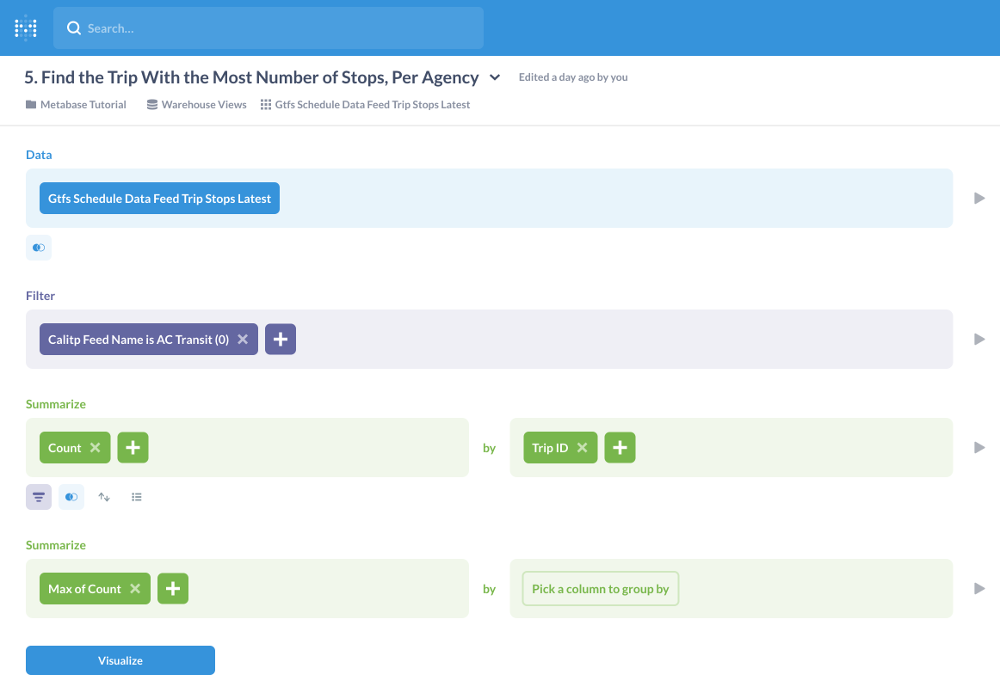

---
jupytext:
  cell_metadata_filter: -all
  formats: md:myst
  text_representation:
    extension: .md
    format_name: myst
    format_version: 0.13
    jupytext_version: 1.10.3
kernelspec:
  display_name: Python 3 (ipykernel)
  language: python
  name: python3
---
(warehouse-tutorial)=
# Tutorial - Querying the Data Warehouse

## Introduction

The following content represents a tutorial introduction to simple queries that can be made to the calitp data warehouse, and the methods that can be used to perform them.

### Example Queries

The queries represented in the following tutorial are as follows:
1. [**Number of Routes for a Given Agency Over Time**](routes-agency-time)
1. [**Number of Stops for a Given Agency Over Time**](stops-agency-time)
1. [**For a Given Agency, on Each Day, Days Until the Feed Expires**](days-feed-expires)
1. [**Number of Stops Made Across all Trips for an Agency**](stops-all-trips)
1. [**Max Number of Stops a Trip Can Have, Per Agency**](max-number-stops)

### Tools Used

The tools that we can use to answer them are:
* [**Metabase**](metabase) - our business insights and dashboarding tool
* [**SQL**](querying-sql-jupyterhub) - using JupyterHub cloud notebooks
* [**Python**](jupyterhub) - using JupyterHub cloud notebooks
    * *siuba* - a Cal-ITP recommended data analysis library in Python
    * *calitp* - Cal-ITP's internal Python library

```{code-cell}
:tags: [remove-cell]
from myst_nb import glue
from calitp.tables import tbl
from siuba import *
import calitp.magics
from calitp import query_sql
```

### Relevant Tables

````{tabbed} Fact Tables
These tables contain measurements, metrics, and facts used to answer the questions from the following perspectives:

| Table Type | Location |
| -------- | -------- |
| **Feeds** | Warehouse: `views.gtfs_schedule_fact_daily_feeds` <br/> Metabase: `Gtfs Schedule Fact Daily Feeds` |
| **Routes** | Warehouse: `views.gtfs_schedule_fact_daily_feed_routes` <br/> Metabase: `Gtfs Schedule Fact Daily Feed Routes` |
| **Stops** | Warehouse: `views.gtfs_schedule_fact_daily_feed_stops` <br/> Metabase: `Gtfs Schedule Fact Daily Feed Stops` |
| **Trips** | Warehouse: `views.gtfs_schedule_data_feed_trip_stops_latest` <br/> Metabase: `Gtfs Schedule Data Feed Trip Stops Latest` |
````

````{tabbed} Dimensional Tables
These tables compliment the fact tables by providing additional descriptive attributes:

| Table | Location | Description |
| -------- | -------- | -------- |
| **Dim Feeds** | Warehouse: `views.gtfs_schedule_dim_feeds` <br/> Metabase: `Gtfs Schedule Dim Feeds` | - Joining with this table is the most common way to append `calitp_feed_name` to fact tables <br/> - `calitp_feed_name` is our primary agency identifier |
````

### Important Column Types

| Column Type | Notable Columns | Description |
| -------- | -------- | -------- |
| **Agency** | Warehouse: `calitp_feed_name` <br/> Metabase: `Calitp Feed Name` | - Our primary agency identifier <br/> - In most of the examples below, this is gathered from the table: `views.gtfs_schedule_dim_feeds` <br/> - Metabase: `Gtfs Schedule Dim Feeds` |
| **Time** | | |
| **Geography** | | |

## Query Examples

(routes-agency-time)=
### 1. Number of Routes for a Given Agency Over Time
This example query uses a fact table describing routes joined with a dimensional table which enriches our data with agency information. We then count the number of routes an agency has published over time.

```{code-cell}
:tags: [remove-cell]
df_routes = query_sql("""
SELECT
    calitp_feed_name,
    date,
    count(*) AS count_routes
FROM `views.gtfs_schedule_fact_daily_feed_routes`
JOIN `views.gtfs_schedule_dim_feeds` USING (feed_key)
WHERE
    calitp_feed_name = "AC Transit (0)"
GROUP BY
    1, 2
ORDER BY
    date DESC
LIMIT 10""", as_df=True)
glue("df_routes_output", df_routes)
```

```{code-cell}
:tags: [remove-cell]
siuba_routes = (
    tbl.views.gtfs_schedule_fact_daily_feed_routes()
    >> left_join(_, tbl.views.gtfs_schedule_dim_feeds(), "feed_key")
    >> filter(_.calitp_feed_name == "AC Transit (0)")
    >> count(_.date)
    >> arrange(_.date)
)

glue("siuba_routes_output", siuba_routes)
```

````{tabbed} Metabase
*You can view this query in Metabase [using this link](https://dashboards.calitp.org/question/215-1-number-of-routes-for-a-given-agency-over-time/notebook)*


````
````{tabbed} SQL
```python
# Allows us to query SQL in the JupyterLab notebook
# Use this in combination with '%%sql', as seen below
import calitp.magics
```
```sql
%%sql

SELECT
    -- The first two columns are the ones we will group by for the count
    calitp_feed_name,               -- agency info
    date,                           -- time info

    -- The aggregation itself
    count(*) AS count_routes

-- Primary fact table, we need this because it contains route information for
-- each agency on each day
FROM `views.gtfs_schedule_fact_daily_feed_routes`

-- Enriching with information about feeds from dimensional table
-- This will include columns such as calitp_feed_name, etc..
JOIN `views.gtfs_schedule_dim_feeds` USING (feed_key)

-- Filtering for agency, this column comes from the dimensional table above
WHERE
    calitp_feed_name = "AC Transit (0)"

GROUP BY
-- Note that 1, 2 refer to the first two columns of the select
    1, 2

ORDER BY
    date DESC
LIMIT 10
```
```{glue:figure} df_routes_output
```
````
````{tabbed} siuba
```python
# Allows us to query tables in the warehouse
from calitp.tables import tbl

# The data analysis library used
from siuba import *
```
```python
(
    # Primary fact table, we need this because it contains route information
    # for each agency on each day
    tbl.views.gtfs_schedule_fact_daily_feed_routes()

    # Enriching with information about feeds from dimensional table
    # This will include columns such as calitp_feed_name, etc..
    >> left_join(_, tbl.views.gtfs_schedule_dim_feeds(), "feed_key")

    # Filtering for agency, this column comes from the dimensional table above
    >> filter(_.calitp_feed_name == "AC Transit (0)")

    # Group and count rows by date, effectively counting the number of routes
    # for a given agency over time
    >> count(_.date)

    # Sort by date
    >> arrange(_.date)
)
```
```{glue:figure} siuba_routes_output
```
````

(stops-agency-time)=
### 2. Number of Stops for a Given Agency Over Time
This example query is very similar to the previous query, except that it substitutes the routes fact table with the stops fact table to count the number of stops an agency has published over time.

```{code-cell}
:tags: [remove-cell]
df_stops = query_sql("""
SELECT
    calitp_feed_name,
    date,
    count(*) AS count_stops
FROM `views.gtfs_schedule_fact_daily_feed_stops`
JOIN `views.gtfs_schedule_dim_feeds` USING (feed_key)
WHERE
    calitp_feed_name = "AC Transit (0)"
GROUP BY
    1, 2
ORDER BY
    date
LIMIT 10""", as_df=True)
glue("df_stops_output", df_stops)
```

```{code-cell}
:tags: [remove-cell]
siuba_stops = (
    tbl.views.gtfs_schedule_fact_daily_feed_stops()
    >> left_join(_, tbl.views.gtfs_schedule_dim_feeds(), "feed_key")
    >> count(_.date, _.calitp_feed_name)
    >> filter(_.calitp_feed_name == "AC Transit (0)")
    >> arrange(_.date)
)
glue("siuba_stops_output", siuba_stops)
```

````{tabbed} Metabase
*You can view this query in Metabase [using this link](https://dashboards.calitp.org/question/216-2-number-of-stops-for-a-given-agency-over-time/notebook)*


````

````{tabbed} SQL
```python
# Allows us to query SQL in the JupyterLab notebook
# Use this in combination with '%%sql', as seen below
import calitp.magics
```
```sql
%%sql

SELECT
    -- The first two columns are the ones we will group by for the count
    calitp_feed_name,               -- agency info
    date,                           -- time info

    -- The aggregation itself
    count(*) AS count_stops

-- Primary fact table, we need this because it contains stops information for
-- each agency on each day
FROM `views.gtfs_schedule_fact_daily_feed_stops`

-- Enriching with information about feeds from dimensional table
-- This will include columns such as calitp_feed_name, etc..
JOIN `views.gtfs_schedule_dim_feeds` USING (feed_key)

-- Filtering for agency, this column comes from the dimensional table above
WHERE
    calitp_feed_name = "AC Transit (0)"

GROUP BY
    -- Note that 1, 2 refer to the first two columns of the select
    1, 2

ORDER BY
    date
LIMIT 10
```
```{glue:figure} df_stops_output
```
````

````{tabbed} siuba
```python
# Allows us to query tables in the warehouse
from calitp.tables import tbl

# The data analysis library used
from siuba import *
```
```python
## Join to get CalITP Feed Names
## Count stops by date and CalITP Feed Names, order by date, filter by specific calitp_feed_name
(
    # Primary fact table, we need this because it contains stop information
    # for each agency on each day
    tbl.views.gtfs_schedule_fact_daily_feed_stops()

    # Enriching with information about feeds from dimensional table
    # This will include columns such as calitp_feed_name, etc..
    >> left_join(_, tbl.views.gtfs_schedule_dim_feeds(), "feed_key")

    # Filtering for agency, this column comes from the dimensional table above
    >> filter(_.calitp_feed_name == "AC Transit (0)")

    # Group and count rows by date and agency, effectively counting the number
    # of stops for a given agency over time
    >> count(_.date, _.calitp_feed_name)

    # Sort by date
    >> arrange(_.date)
)
```

```{glue:figure} siuba_stops_output
```
````
(days-feed-expires)=
### 3. For a Given Agency, on Each Day, Days Until the Feed Expires
This query uses a fact table as we did in queries the previous two queries. However, instead of counting we pull out previously calculated table columns as important pieces of information.

```{code-cell}
:tags: [remove-cell]
df_feed_expires = query_sql("""
SELECT
    calitp_feed_name,
    date,
    days_until_feed_end_date,
    feed_end_date
FROM views.gtfs_schedule_fact_daily_feeds
JOIN views.gtfs_schedule_dim_feeds USING (feed_key)
WHERE
    date = "2021-09-01" AND calitp_feed_name = "AC Transit (0)"
LIMIT 10""", as_df=True)
glue("df_feed_expires_output", df_feed_expires)
```

```{code-cell}
:tags: [remove-cell]
siuba_feed_expires = (
    tbl.views.gtfs_schedule_fact_daily_feeds()
    >> left_join(_, tbl.views.gtfs_schedule_dim_feeds(), "feed_key")
    >> select(_.calitp_feed_name, _.date, _.days_until_feed_end_date, _.feed_end_date)
    >> filter(_.date == "2021-09-01", _.calitp_feed_name == "AC Transit (0)")
)
glue("siuba_feed_expires_output", siuba_feed_expires)
```

````{tabbed} Metabase
*You can view this query in Metabase [using this link](https://dashboards.calitp.org/question/227-4-for-a-given-agency-on-each-day-days-until-the-feed-expires/notebook)*


````
````{tabbed} SQL
```python
# Allows us to query SQL in the JupyterLab notebook
# Use this in combination with '%%sql', as seen below
import calitp.magics
```
```sql
%%sql

SELECT
    calitp_feed_name,               -- agency info
    date,                           -- time info
    days_until_feed_end_date,       -- time until feed expires, for a given day
    feed_end_date                   -- the day the feed expires

-- Primary fact table, we need this because it contains information on
-- agency feeds
FROM views.gtfs_schedule_fact_daily_feeds

-- Enriching with information about feeds from dimensional table
-- This will include columns such as calitp_feed_name, etc..
JOIN views.gtfs_schedule_dim_feeds USING (feed_key)

-- Filtering for our particular day and agency
-- The agency info column comes from the dimensional table above
WHERE
    date = "2021-09-01" AND calitp_feed_name = "AC Transit (0)"

LIMIT 10
```
```{glue:figure} df_feed_expires_output
```
````

````{tabbed} siuba
```python
# Allows us to query tables in the warehouse
from calitp.tables import tbl

# The data analysis library used
from siuba import *
```
```python
(
    # Primary fact table, we need this because it contains information on
    # agency feeds
    tbl.views.gtfs_schedule_fact_daily_feeds()

    # Enriching with information about feeds from dimensional table
    # This will include columns such as calitp_feed_name, etc..
    >> left_join(_, tbl.views.gtfs_schedule_dim_feeds(), "feed_key")

    # Keeping the columns that we need for this query
    >> select(_.calitp_feed_name, _.date, _.days_until_feed_end_date, _.feed_end_date)

    # Filtering for our particular day and agency
    >> filter(_.date == "2021-09-01", _.calitp_feed_name == "AC Transit (0)")
)
```
```{glue:figure} siuba_feed_expires_output
```
````
(stops-all-trips)=
### 4. Number of Stops Made Across all Trips for an Agency
Instead of using fact or dimensional tables as in the examples above, this query and the next use a wide convenience table that was created to aggregate trip stops information from only the most recent feeds extracted. Information for the latest day can be found in this table.

We use this table to query an agency's most recent feed published and count the total number of trip stops, as well as the number of distinct trips and stops that compose them.

```{code-cell}
:tags: [remove-cell]
df_stops_trips = query_sql("""
SELECT
    calitp_feed_name,
    count(*) AS n_trip_stops,
    count(distinct(trip_id)) AS n_trips,
    count(distinct(stop_id)) AS n_stops
FROM `views.gtfs_schedule_data_feed_trip_stops_latest`
WHERE
    calitp_feed_name = "AC Transit (0)"
GROUP BY
    calitp_feed_name
LIMIT 10""", as_df=True)
glue("df_stops_trips_output", df_stops_trips)
```

```{code-cell}
:tags: [remove-cell]
siuba_stops_trips = (
    tbl.views.gtfs_schedule_data_feed_trip_stops_latest()
    >> filter(_.calitp_feed_name == "AC Transit (0)")
    >> summarize(
        n_trips=_.trip_id.nunique(), n_stops=_.stop_id.nunique(), n=_.trip_id.size()
    )
)
glue("siuba_stops_trips_output", siuba_stops_trips)
```

````{tabbed} Metabase
***4A. Count of Trip Stops Made Across all Trips for an Agency***

*You can view this query in Metabase [using this link](https://dashboards.calitp.org/question/224-3a-count-of-trip-stops-made-across-all-trips-for-an-agency/notebook)*


***4B. Distinct Trips in Trip Stops***

*You can view this query in Metabase [using this link](https://dashboards.calitp.org/question/225-3b-distinct-trips-in-trip-stops-for-an-agency/notebook)*


***4C. Distinct Stops in Trip Stops***

*You can view this query in Metabase [using this link](https://dashboards.calitp.org/question/226-3c-distinct-stops-in-trip-stops-for-an-agency/notebook)*


````
````{tabbed} SQL
```python
# Allows us to query SQL in the JupyterLab notebook
# Use this in combination with '%%sql', as seen below
import calitp.magics
```
```sql
%%sql

SELECT
    -- The first column is what we will group by
    calitp_feed_name,               -- agency info

    -- Counting the total number of trip stops
    COUNT(*) AS n_trip_stops,
    -- Counting the number of unique trips
    COUNT(DISTINCT(trip_id)) AS n_trips,
    -- Counting the number of unique stops
    COUNT(DISTINCT(stop_id)) AS n_stops

-- Primary fact table, we need this because it contains trip stop information
-- for each agency on each day in the latest feed
FROM `views.gtfs_schedule_data_feed_trip_stops_latest`

-- Filtering for each agency
WHERE
    calitp_feed_name = "AC Transit (0)"

-- The column we need to group by
GROUP BY
    calitp_feed_name

LIMIT 10
```
```{glue:figure} df_stops_trips_output
```
````

````{tabbed} siuba
```python
# Allows us to query tables in the warehouse
from calitp.tables import tbl

# The data analysis library used
from siuba import *
```
```python
(
    # Primary fact table, we need this because it contains trip stop information
    # for each agency on each day in the latest feed
    tbl.views.gtfs_schedule_data_feed_trip_stops_latest()

    # Filtering for agency
    >> filter(_.calitp_feed_name == "AC Transit (0)")

    # using siuba and pandas to determine number of unique trips, number of
    # unique stops, and the total number of trip stops
    >> summarize(
        n_trips=_.trip_id.nunique(), n_stops=_.stop_id.nunique(), n=_.trip_id.size()
    )
)
```
```{glue:figure} siuba_stops_trips_output
```
````
(max-number-stops)=
### 5. Find the Trip With the Most Number of Stops, Per Agency
Similar to the previous query, this example uses the same wide convenience table. We use this table here to determine the trip that contains the most number of stops in the latest feed, by agency.

```{code-cell}
:tags: [remove-cell]
df_max_stops = query_sql("""
WITH

counting_stop_times AS (

    -- count the number of stops each trip in each feed makes
    SELECT
        trip_id,
        calitp_feed_name,
        COUNT(*) AS n_trip_stop_times
    FROM `views.gtfs_schedule_data_feed_trip_stops_latest`
    GROUP BY
        1, 2
)

-- calculate the max number of stops made by a feed's trip
-- we filter to keep only the Unitrans feed for this example
SELECT
    calitp_feed_name,
    MAX(n_trip_stop_times) AS max_n_trip_stop_times
FROM
    counting_stop_times
WHERE
     calitp_feed_name = "AC Transit (0)"
GROUP BY
    calitp_feed_name
LIMIT 10""", as_df=True)
glue("df_max_stops_output", df_max_stops)
```

```{code-cell}
:tags: [remove-cell]
siuba_max_stops = (
    tbl.views.gtfs_schedule_data_feed_trip_stops_latest()
    >> count(_.trip_id, _.calitp_feed_name)
    >> filter(_.calitp_feed_name == "AC Transit (0)")
    >> summarize(n_max=_.n.max())
)
glue("siuba_max_stops_output", siuba_max_stops)
```

````{tabbed} Metabase
*You can view this query in Metabase [using this link](https://dashboards.calitp.org/question/223-5-find-the-trip-with-the-most-number-of-stops-per-agency/notebook)*


````

````{tabbed} SQL
```python
# Allows us to query SQL in the JupyterLab notebook
# Use this in combination with '%%sql', as seen below
import calitp.magics
```
```sql
%%sql

-- Using a WITH clause to create a sub-query counting the number of stops each
-- trip in each feed makes, to be referenced later in the query
WITH

-- The name of the sub-query block to be referenced later
counting_stop_times AS (

    SELECT
        -- The first two columns are the ones we will group by for the count
        trip_id,                        -- unique trip identifier
        calitp_feed_name,               -- agency info

        -- The aggregation itself
        COUNT(*) AS n_trip_stop_times

    -- Primary fact table, we need this because it contains trip stop
    -- information for each agency on each day in the latest feed
    FROM `views.gtfs_schedule_data_feed_trip_stops_latest`

    -- Note that 1, 2 refer to the first two columns of the select
    GROUP BY
        1, 2
)

SELECT
    -- The first columns is the one we will group by for the count
    -- These columns come from the sub-query above
    calitp_feed_name,               -- agency info
    MAX(n_trip_stop_times) AS max_n_trip_stop_times -- trip with most stops

-- The sub-query block we created above
FROM
    counting_stop_times

-- Filtering for agency
WHERE
     calitp_feed_name = "AC Transit (0)"

-- The column we need to group by
GROUP BY
    calitp_feed_name
LIMIT 10
```
```{glue:figure} df_max_stops_output
```
````
````{tabbed} siuba
```python
# Allows us to query tables in the warehouse
from calitp.tables import tbl

# The data analysis library used
from siuba import *
```
```python
(
    # Primary fact table, we need this because it contains trip stop information
    # for each agency on each day in the latest feed
    tbl.views.gtfs_schedule_data_feed_trip_stops_latest()

    # Group and count rows by trip ID and agency, effectively counting the
    # number of stops for a given trip by agency in the latest feed
    >> count(_.trip_id, _.calitp_feed_name)

    # Filtering for agency
    >> filter(_.calitp_feed_name == "AC Transit (0)")

    # Find the trip with the largest number of stops
    >> summarize(n_max=_.n.max())
)
```

```{glue:figure} siuba_max_stops_output
```

````

## More Complex Query Examples

### Introduction

The queries represented in the following tutorial are as follows:
* [**All the Stops and Arrival Times for an Operator on a Given Day**](stop-arrivals-operator)
* [**Assemble a Route Shapefile**](#assemble-a-route-shapefile)
* [**Filter with Lists and Unpacking**](#filter-with-lists-and-unpacking)

### Python Libraries to Import

```{code-cell}
import geopandas as gpd
import os
import pandas as pd
import shapely

os.environ["CALITP_BQ_MAX_BYTES"] = str(50_000_000_000)

import calitp
from calitp.tables import tbl
from siuba import *

pd.set_option("display.max_rows", 10)

SELECTED_DATE = "2021-09-01"
ITP_ID = 278 # San Diego Metropolitan Transit System
```

(all-stops-arrivals)=
### 6. All the Stops and Arrival Times for an Operator on a Given Day
As a simple example, we will filter to just the San Diego Metropolitan Transit System and grab 1 day’s worth of data. We want all the trips, stops, arrival times, and stop geometry (lat/lon).

Tables used:
1. `views.gtfs_schedule_dim_stop_times`: all stop arrival times for all operators, need to subset to particular date
1. `views.gtfs_schedule_fact_daily_trips`: all trips for all operators, need to subset to particular date
1. `views.gtfs_schedule_dim_stops`: lat/lon for all stops, need to subset to interested stops

Here, all the trips for one operator, for a particular day, is joined with all the stops that occur on all the trips. Then, the stops have their lat/lon information attached.

COPY SQL CODE CELL FROM ABOVE HERE

```{code-cell}
:tags: [remove-cell]
tbl_stop_times = (
    tbl.views.gtfs_schedule_dim_stop_times()
    >> filter(_.calitp_extracted_at <= SELECTED_DATE,
              _.calitp_deleted_at > SELECTED_DATE,
              _.calitp_itp_id == ITP_ID
             )
)

daily_stops = (
    tbl.views.gtfs_schedule_fact_daily_trips()
    >> filter(_.calitp_itp_id == ITP_ID,
              _.service_date == SELECTED_DATE,
              _.is_in_service == True)
    >> left_join(_, tbl_stop_times,
             ["calitp_itp_id", "calitp_url_number", "trip_id"])
    >> inner_join(_, tbl.views.gtfs_schedule_dim_stops(),
                 ["calitp_itp_id", "stop_id"])
    >> select(_.itp_id == _.calitp_itp_id,
              _.date == _.service_date,
              _.trip_key, _.trip_id, _.stop_id, _.arrival_time,
              _.stop_lat, _.stop_lon, _.stop_name,
             )
    >> collect()
)
glue("daily_stops_output", daily_stops)
```

````{tabbed} Metabase
blank block
````

````{tabbed} SQL
```python
# Allows us to query SQL in the JupyterLab notebook
# Use this in combination with '%%sql', as seen below
import calitp.magics
```
````
````{tabbed} siuba
```python
## Get trips for operator for one day and join with stop times for all trips

# Grab the stop times for a given date for just 1 agency
tbl_stop_times = (
    tbl.views.gtfs_schedule_dim_stop_times()
    >> filter(_.calitp_extracted_at <= SELECTED_DATE,
              _.calitp_deleted_at > SELECTED_DATE,
              _.calitp_itp_id == ITP_ID
             )
)

# Grab the trips done on that day, for that agency
daily_stops = (
    tbl.views.gtfs_schedule_fact_daily_trips()
    >> filter(_.calitp_itp_id == ITP_ID,
              _.service_date == SELECTED_DATE,
              _.is_in_service == True)
    # Join the trip to the stop time
    # For a given bus route (left df), attach all the stops (right df)
    >> left_join(_, tbl_stop_times,
              # also added url number to the join keys ----
             ["calitp_itp_id", "calitp_url_number", "trip_id"])
    >> inner_join(_, tbl.views.gtfs_schedule_dim_stops(),
                 ["calitp_itp_id", "stop_id"])
    >> select(_.itp_id == _.calitp_itp_id,
              _.date == _.service_date,
              _.trip_key, _.trip_id, _.stop_id, _.arrival_time,
              _.stop_lat, _.stop_lon, _.stop_name,
             )
    >> collect()
    )
```
{glue:figure} daily_stops_output
````
