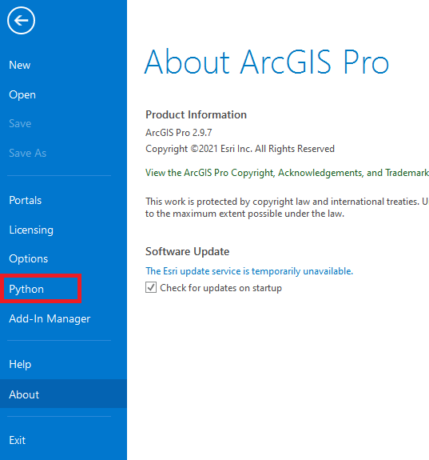
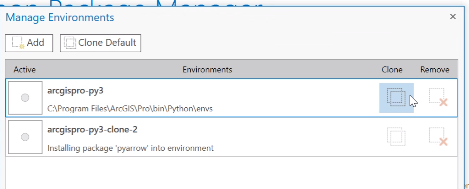
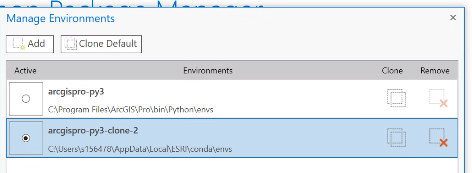
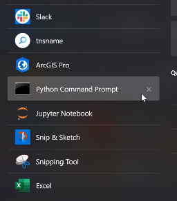
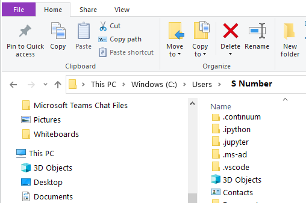

# Local Oracle Database Connections

This document is an aid for setting up a local connection to an Oracle Database using ArcGIS environments, Python Command Prompt, and a local Jupyter Notebook setup.

## First Time Set-up:

**Step 1:** Make sure you have ArcGIS Pro installed on your computer. As part of the ArcGIS Pro installation, Python Command Prompt and Jupyter Notebook should also have been installed as well.

If you do not have ArcGIS Pro installed, submit a SNOW ticket for “ArcPro.”

**Step 2:** Once ArcGIS is installed, open it and go to “Settings” (located at the bottom of the page) and navigate to “Python” on the left blue sidebar.



**Step 3:** Go to “Manage Environments” under “Project Environment”


**Step 4:** Clone the environment by clicking the “Clone Default” button next to “Add” -OR- hover beneath the column titled “Clone” until the two squares are shaded.



**Step 5:** Once the cloned environment is complete, select the radio button under “Activate” to activate the cloned environment and click “OK”.



**Step 6:** Then when you are in your new cloned environment, search in the Start Menu for Python Command Prompt and open. Your Python Command Prompt Screen should have the name of your cloned environment (`arcgispro-py3-clone`) in the command line.




**Step 7:** In the Python Command Prompt Command Line enter the following commands to install SQLAlchemy . When prompted if you want to proceed, enter `y` for yes for all commands. This process will take awhile.

```bash
conda uninstall sqlalchemy

conda install sqlalchemy

conda install python

conda update pip

python –m pip install oracledb

```

  - python will be uninstalled when sqlalchemy is uninstalled so we need to reinstall.


**Step 8:**
1. Determine what directory you are in and navigate to your directory of choice within Python Command Prompt.  It is highly  recommended to go into your S Number folder (i.e. `cd C:\Users\SNUMBER`)
    * TIP: [See this Bash cheat sheet with some helpful commands](https://hpc.ua.edu/wp-content/uploads/2022/02/Linux_bash_cheat_sheet.pdf)


2. Open File Explorer and navigate to the same directory you are in the command line. Add a new folder to house your Jupyter Notebooks. Make sure the folder name does not have any spaces.



3. Open a new Python Command Prompt Window. Navigate to the same directory, only adding the name of your new folder (cell #1 below). Then, open a Jupyter Lab (cell #2 below).
    * This should open a new internet tab with Jupyter Lab.
    * TIP: you can use `dir` to find out what files and folders you are in your current directory.


```bash
cd C:\Users\SNUMBER/Notebook_Folder
##example of path you can take to get into the directory of your choice. In this case, we are navigating to the Notebooks folder we just created above.
```
```bash
jupyter lab
```

**Step 9:** Once Jupyter Lab has popped up, you should see your new folder on the sidebar. You can also create new folders within Jupyter lab to house your notebooks and scripts.

<span style="color:red"> **What is a Jupyter Notebook?** </span> A Jupyter Notebook allows you to write and execute code (in our case, Python). The notebook format also makes it easy to display graphs and narrative, so you can analyze data and present the findings all in one platform. This lessens the workload of recopying work into PowerPoint or Word in many cases. [For more information, read our docs on notebooks here.](https://docs.calitp.org/data-infra/analytics_new_analysts/04-notebooks.html)


**Step 10:** Open a notebook: make sure you are on the launcher tab.Under the orange square titled “Notebook” click on the blue and yellow plus sign with Python 3 underneath it. This will open up a new notebook.


Go to the left sidebar and see your new notebook. Right now, it is named untitled.ipynb. It is recommended to rename the notebook without spaces, using underscores instead. For example,
  `my_notebook.ipynb` is easier to access compared to `My Notebook.ipynb`.

In the notebook, copy the following in the notebook cells.  It is recommended to copy this in chunks, as delineated by the lines in the table. To run the code, you can press SHIFT + ENTER.

```python
import pandas as pd
import sqlalchemy
import sys
import oracledb

oracledb.version = "8.3.0"
```
```python
sys.modules["cx_Oracle"] = oracledb
```

```python
sqlalchemy.__version__
##checks the version of sqlalchemy. Output should read version   ``1.4.39`
```


**Step 11:** Connect to the database. For this step, you will need the database Username, Password, Host Name, Service Name and Port.

```python
DIALECT = 'oracle'

USERNAME = 'username' #enter your username
PASSWORD = 'password' #enter your password
HOST = 'host_name' #enter the oracle db host url
PORT = 1521 # enter the oracle port number
SERVICE = 'service_name' # enter the oracle db service name

ENGINE_PATH_WIN_AUTH = f"{DIALECT}://{USERNAME}:{PASSWORD}@{HOST}:{PORT}/?service_name={SERVICE}"
```

```python
engine = sqlalchemy.create_engine(ENGINE_PATH_WIN_AUTH)
```
```python
## test the query

pd.read_sql_query(""" select 'hello' from dual WHERE 1=1""", engine)

## should return a one row, one column dataframe with `hello` in the first cell.
## if that is the output then you are all set!

```

Note: Clone environment may reset after the day.

## Everyday Workflow

**Step 1:** Open up Python Command Prompt.

**Step 2:** Confirm that you are in the clone environment. Your clone environment should be at the beginning of the command line (as seen below).


If you are not in a clone environment, you may need to repeat the setup, steps 1-7 (working on a better fix). If this is the case, make sure to remove the `arcgispro-py3-clone` environment before repeating steps 1-7.


**Step 3:** Once you have confirmed that you are in the clone environment you set up, navigate using `cd ../` to the directory you chose in Step 8 of the setup (recommended `C:\\Users\SNUMBER`).

**Step 4:** Open up Jupyter Lab or JupyterHub by typing in the command line, as displayed in step 8.
