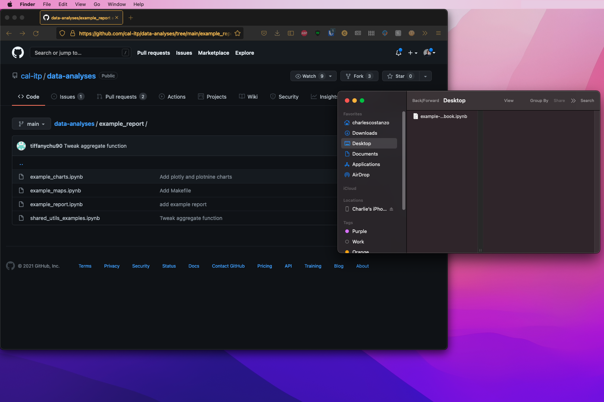
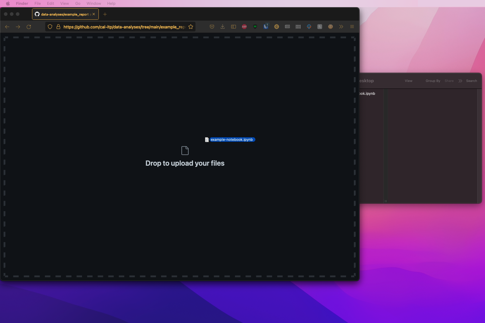

(saving-code)=

# Saving Code

Most Cal-ITP analysts should opt for working and committing code directly from JupyterHub. Leveraging this cloud-based, standardized environment should alleviate many of the pain points associated with creating reproducible, collaborative work.

Doing work locally and pushing directly from the command line is a similar workflow, but replace the JupyterHub terminal with your local terminal.

## Table of Contents

1. What's a typical [project workflow](#project-workflow)?
2. Someone is collaborating on my branch, how do we [stay in sync](#pulling-and-pushing-changes)?
   - The `main` branch is ahead, and I want to [sync my branch with `main`](#rebase-and-merge)
   - [Rebase](#rebase) or [merge](#merge)
   - Options to [Resolve Merge Conflicts](#resolve-merge-conflicts)
3. [Other Common GitHub Commands](#other-common-github-commands)
   - [External Git Resources](#external-git-resources)
   - [Committing in the Github User Interface](#pushing-drag-drop)

(project-workflow)=

## Project Workflow

It is best practice to do have a dedicated branch for your task. A commit in GitHub is similar to saving your work. It allows the system to capture the changes you have made and offers checkpoints through IDs that both show the progress of your work and can be referenced for particular tasks.

In the `data-analyses` repo, separate analysis tasks live in their own directories, such as `data-analyses/gtfs_report_emails`.

01. Start from the `main` branch: `git pull origin main`
02. Check out a new branch to do your work: `git switch -c my-new-branch`
03. Do some work...add, delete, rename files, etc
04. See all the status changes to your files: `git status`
05. When you're ready to save some of that work, stage the files you want to commit with `git add foldername/notebook1.ipynb foldername/script1.py`. To stage all the files, use `git add .`.
06. Once you are ready to commit, add a commit message to associate with all the changes: `git commit -m "exploratory work"`
07. Push those changes from local to remote branch (note: branch is `my-new-branch` and not `main`): `git push origin my-new-branch`.
08. To review a log of past commits: `git log`
09. When you are ready to merge all the commits into `main`, open a pull request (PR) on the remote repository, and merge it in!
10. Go back to `main` and update your local to match the remote: `git switch main`, `git pull origin main`
11. Once you've merged your branch into `main` and deleted it from the remote, you can delete your branch locally: `git branch -d my-new-branch`. You can reuse the branch name later.

## Pulling and Pushing Changes

Especially when you have a collaborator working on the same branch, you want to regularly sync your work with what's been committed by your collaborator. Doing this frequently allows you to stay in sync, and avoid unnecessary merge conflicts.

1. Stash your changes temporarily: `git stash`
2. Pull from the remote to bring the local branch up-to-date (and pull any changes your collaborator made): `git pull origin my-new-branch`
3. Pop your changes: `git stash pop`
4. Stage and push your commit with `git add` and `git commit` and `git push origin my-new-branch`

(rebase-and-merge)=

### Syncing my Branch with Main

If you find that the `main` branch is ahead, and you want to sync your branch with `main` you'll need to use one of the below commands:

- [Rebase](#rebase)
- [Merge](#merge)

Read more about the differences between `rebase` and `merge`:

- [Atlassian tutorial](https://www.atlassian.com/git/tutorials/merging-vs-rebasing)
- [GitKraken](https://www.gitkraken.com/learn/git/problems/git-rebase-vs-merge)
- [Hackernoon](https://hackernoon.com/git-merge-vs-rebase-whats-the-diff-76413c117333)
- [Stack Overflow](https://stackoverflow.com/questions/59622140/git-merge-vs-git-rebase-for-merge-conflict-scenarios)
   

(rebase)=

#### Rebase

Rebasing is an important tool to be familiar with and introduce into your workflow. The video and instructions below help to provide information on how to begin using it in your collaborations with the team.

[Youtube - A Better Git Workflow with Rebase](https://www.youtube.com/watch?v=f1wnYdLEpgI)

A rebase might be preferred, especially if all your work is contained on your branch, within your task's folder, and lots of activity is happening on `main`. You'd like to plop all your commits onto the most recent `main` branch, and have it appear as if all your work took place *after* those PRs were merged in.

1. At this point, you've either stashed or added commits on `my-new-branch`.
2. Check out the `main` branch: `git switch main`
3. Pull from origin: `git pull origin main`
4. Check out your current branch: `git switch my-new-branch`
5. Rebase and rewrite history so that your commits come *after* everything on main: `git rebase main`
6. At this point, the rebase may be successful, or you will have to address any conflicts! If you want to abort, use `git rebase --abort`. Changes in scripts will be easy to resolve, but notebook conflicts are difficult. If conflicts are easily resolved, open the file, make the changes, then `git add` the file(s), and `git rebase --continue`.
7. Make any commits you want (from step 1) with `git add`, `git commit -m "commit message"`
8. Force-push those changes to complete the rebase and rewrite the commit history: `git push origin my-new-branch -f`

(merge)=

#### Merge

Note: Merging with [fast-forward](https://git-scm.com/docs/git-merge#Documentation/git-merge.txt---ff) behaves similarly to a rebase.

1. At this point, you've either stashed or added commits on `my-new-branch`.
2. Pull from origin: `git switch main` and `git pull origin main`
3. Go back to your branch: `git switch my-new-branch`
4. Complete the merge of `my-new-branch` with `main` and create a new commit: `git merge my-new-branch main`
5. A merge commit window opens up. Type `:wq` to exit and complete the merge.
6. Type `git log` to see that the merge commit was created.

(resolve-merge-conflicts)=

### Options for Resolving Merge Conflicts

If you discover merge conflicts and they are within a single notebook that only you are working on it can be relatively easy to resolve them using the Git command line instructions:

- From the command line, run `git merge main`. This should show you the conflict.
- From here, there are two options depending on what version of the notebook you'd like to keep.
  - To keep the version on your branch, run: 
    `git checkout --ours path/to/notebook.ipynb`
  - To keep the remote version, run: 
    `git checkout --theirs path/to/notebook.ipynb`
- From here, just add the file and commit with a message as you normally would and the conflict should be fixed in your Pull Request.

(other-common-github-commands)=

## Other Common GitHub Commands

These are helpful Git commands an analyst might need, listed in no particular order.

- During collaboration, if another analyst already created a remote branch, and you want to work off of the same branch: `git fetch origin`, `git switch -c our-project-branch origin/our-project-branch`
- To discard the changes you made to a file, `git checkout my-notebook.ipynb`, and you can revert back to the version that was last committed.
- Temporarily stash changes, move to a different branch, and come back and retain those changes: `git stash`, `git switch some-other-branch`, do stuff on the other branch, `git switch original-branch`, `git stash pop`
- Rename files and retain the version history associated (`mv` is move, and renaming is moving the file path): `git mv old-notebook.ipynb new-notebook.ipynb`
- Set your local `main` branch to be the same as the remote branch: `git fetch origin git reset --hard origin/main`
- To delete a file that's been added in a previous commit: `git rm notebooks/my-notebook.ipynb`
- Cherry pick a commit and apply it to your branch: `git cherry-pick COMMIT_HASH`. Read more from [Stack Overflow](https://stackoverflow.com/questions/9339429/what-does-cherry-picking-a-commit-with-git-mean) and [Atlassian](https://www.atlassian.com/git/tutorials/cherry-pick).

(external-git-resources)=

### External Resources

- [Git Terminal Cheat Sheet](https://gist.github.com/cferdinandi/ef665330286fd5d7127d)
- [Git Decision Tree - 'So you have a mess on your hands'](http://justinhileman.info/article/git-pretty/full/)

(pushing-drag-drop)=

### Committing in the Github User Interface

If you would like to commit directly from the Github User Interface:

1. Navigate the Github repository and folder that you would like to add your work, and locate the file on your computer that you would like to commit

   

2. 'Click and Drag' your file from your computer into the Github screen

   
