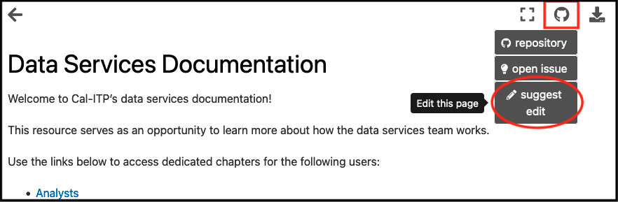
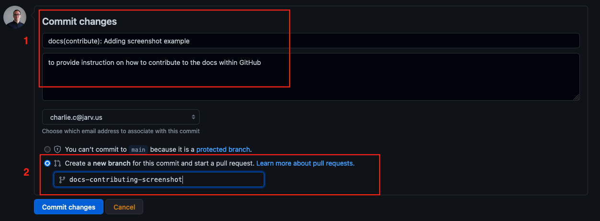
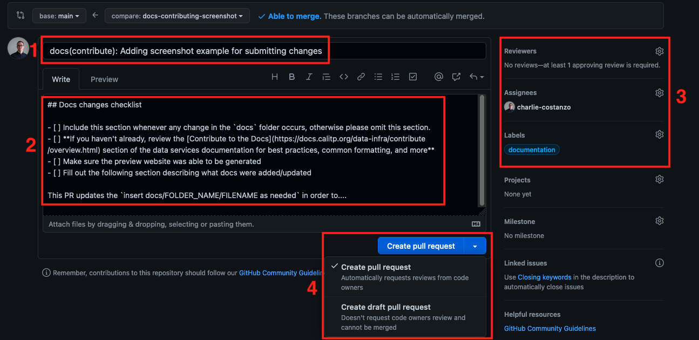
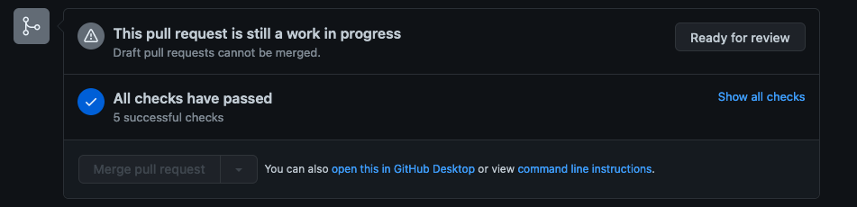
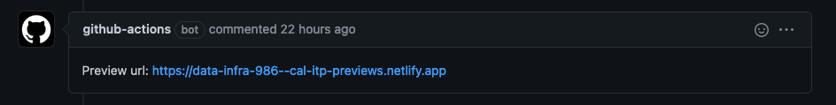

(submitting-changes)=
# Submitting Changes

## Making Changes and Merging PRs

### Using Git (Command Line)

* Follow the [Conventional Commits](https://www.conventionalcommits.org/en/v1.0.0/) standard for all commits and PR titles
  * Prefix docs commits and PR titles with `docs(subject-area):`
* Install pre-commit hooks
  * `pip install pre-commit`, `pre-commit install`
  * If needed, run `pre-commit run --all-files` to run the hooks on all files, not just those staged for changes.
* Use GitHub's *draft* status to indicate PRs that are not ready for review/merging
* Do not use GitHub's "update branch" button or merge the `main` branch back into a PR branch to update it. Instead, rebase PR branches to update them and resolve any merge conflicts.

### Using the GitHub User Interface (Website)
These documents are currently editable on GitHub's website. To use the GitHub website to make changes:
#### Navigate to GitHub and make changes

* Click the GitHub icon in the top right corner of the page you'd like to edit and choose `Suggest Edit`.
* Make changes on that page using the [proper formatting](content-types).
#### Commit your changes and create a new branch

* On the page that you've edited, navigate to the bottom and find where it says `Commit changes`.
* (1) Add a short title and description for your changes. Make sure to being the title with `docs(subject-area):`, as according to the Conventional Commits standard.
* (2) Select the second option `Create a new branch...` and add a short but descriptive name for this new branch.
* Select `Commit Changes`. This will take you to a new page to create a `Pull Request`, the mechanism that will allow your new work to be added to the docs.
#### Create a Pull Request for review and merging

* After committing your changes you will be brought to another page, creating a PR.
* (1) Give your PR a descriptive title that has a prefix of `docs(subject-area):`, as according to the Conventional Commits standard.
* (2) You will find there is already an existing template in the description area. Scroll to the bottom and use only the portion beneath `Docs changes checklist`. Add description where requested.
* (3) In the right-hand sidebar, add:
  * Reviewers: This is the person or people who will review and approve your edits to be added to the main codebase. If no one is selected, the docs `CODEOWNER` will be flagged for review. Beyond that, request those who will be affected by changes or those with expertise in relevant subject areas.
  * Assignees: If this is your work, tag yourself here. Also tag any collaborators that you may have had.
  * Affix the label `documentation` to more easily keep track of this work.
* (4) If this work is ready for review, select 'Create pull request'. If more work is required, select 'Create draft pull request' from the dropdown.
* Once you have created a PR and it has been reviewed and approved, beyond any requested changes, you will be notified that your work has been merged into the live documentation!

## How is the documentation GitHub action triggered?
A GitHub action is triggered on pushes to the `data-infra` repository from the `docs` directory. This action verifies proper syntax for any changes and generates a preview of your docs. You can see if this action was successful from the bottom of your PR.

## How do I preview my documentation change?
Once the GitHub action has run and all tests have passed a 'Netlify' preview link will be generated. You can find this link in the comments of your PR. Follow that link to preview your changes.

