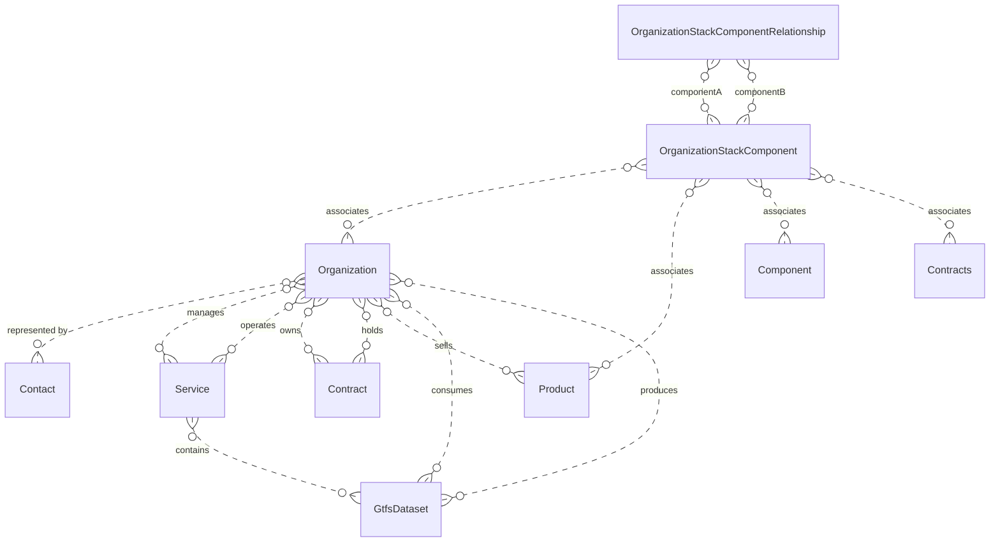

# Transitstacks

## Data

| dataset | description |
| ------- | ----------- |
|  |  |

```mermaid
erDiagram
    Organization }o..o{ Contact : "represented by"
    Organization }o..o{ Service: "manages"
    Organization }o..o{ Service: "operates"
    Organization }o..o{ Contract: "owns"
    Organization }o..o{ Contract: "holds"
    Organization }o..o{ Product: "sells"
    Organization }o..o{ GtfsDataset: "consumes"
    Organization }o..o{ GtfsDataset: "produces"

    Service }o..o{ GtfsDataset: "contains"

    OrganizationStackComponent }o..o{ Organization: "associates"
    OrganizationStackComponent }o..o{ Product: "associates"
    OrganizationStackComponent }o..o{ Component: "associates"
    OrganizationStackComponent }o..o{ Contracts: "associates"

    OrganizationStackComponentRelationship }o..o{ OrganizationStackComponent: componentA
    OrganizationStackComponentRelationship }o..o{ OrganizationStackComponent: componentB
```

## Dashboards

## Maintenance

### DAGs overview
