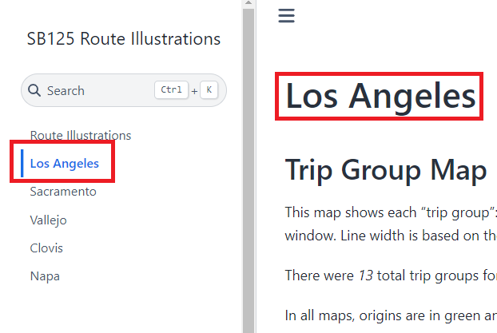
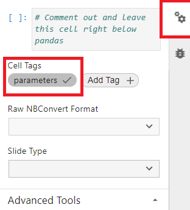

# Getting Notebooks Ready for the Portfolio

We want all the content on our [portfolio](https://analysis.calitp.org/) to be consistent and tidy. Below are some guidelines for you to follow when creating the Jupyter Notebooks.

## Narrative

- Narrative content can be done in Markdown cells or code cells.
  - Markdown cells should be used when there are no variables to inject.
  - Code cells should be used to write narrative whenever variables constructed from f-strings are used.
- Markdown cells can inject f-strings if it's plain Markdown (not a heading) using `display(Markdown())` in a code cell.

```
from IPython.display import Markdown

display(Markdown(f"The value of {variable} is {value}."))
```

- **Use f-strings to fill in variables and values instead of hard-coding them**
  - Turn anything that runs in a loop or relies on a function into a variable.
  - Use functions to grab those values for a specific entity (operator, district), rather than hard-coding the values into the narrative.

```
n_routes = (df[df.organization_name == operator]
            .route_id.nunique()
            )


n_parallel = (df[
            (df.organization_name == operator) &
            (df.parallel==1)]
            .route_id.nunique()
            )

display(
    Markdown(
        f"**Bus routes in service: {n_routes}**"
        "<br>**Parallel routes** to State Highway Network (SHN): "
        f"**{n_parallel} routes**"
        )
)
```

- Stay away from loops if you need to use headers.
  - You will need to create Markdown cells for headers or else JupyterBook will not build correctly. For parameterized notebooks, this is an acceptable trade-off.
  - For unparameterized notebooks, you may want use `display(HTML())`.
  - Caveat: Using `display(HTML())` means you'll lose the table of contents navigation in the top right corner in the JupyterBook build.

## Writing Guide

These are a set of principles to adhere to when writing the narrative content in a Jupyter Notebook. Use your best judgment to decide when there are exceptions to these principles.

- Decimals less than 1, always prefix with a 0, for readability.

  - 0.05, not .05

- Integers when referencing dates, times, etc

  - 2020 for year, not 2020.0 (coerce to int64 or Int64 in `pandas`; Int64 are nullable integers, which allow for NaNs to appear alongside integers)
  - 1 hr 20 min, not 1.33 hr (use best judgment to decide what's easier for readers to interpret)

- Round at the end of the analysis. Use best judgment to decide on significant digits. National Institutes of Health has a guide on [Rounding Rules](https://www.ncbi.nlm.nih.gov/pmc/articles/PMC4483789/#:~:text=Ideally%20data%20should%20be%20rounded,might%20call%20it%20Goldilocks%20rounding.&text=The%20European%20Association%20of%20Science,2%E2%80%933%20effective%20digits%E2%80%9D.).

  - Too many decimal places give an air of precision that may not be present.
  - Too few decimal places may not give enough detail to distinguish between categories or ranges.
  - A good rule of thumb is to start with 1 extra decimal place than what is present in the other columns when deriving statistics (averages, percentiles), and decide from there if you want to round up.
    - An average of `$100,000.0` can simply be rounded to `$100,000`.
    - An average of 5.2 mi might be left as is.

- Additional references: [American Psychological Association (APA) style](https://apastyle.apa.org/instructional-aids/numbers-statistics-guide.pdf) and [Purdue](https://owl.purdue.edu/owl/research_and_citation/apa_style/apa_formatting_and_style_guide/apa_numbers_statistics.html).

## Standard Names

- GTFS data in our warehouse stores information on operators, routes, and stops.
- Analysts should reference the operator name, route name, and Caltrans district the same way across analyses.
  - Caltrans District: 7 should be referred to as `07 - Los Angeles`
  - Between `route_short_name`, `route_long_name`, `route_desc`, which one should be used to describe `route_id`? Use `shared_utils.portfolio_utils`, which relies on regular expressions, to select the most human-readable route name.
- Use [`shared_utils.portfolio_utils`](https://github.com/cal-itp/data-analyses/blob/main/_shared_utils/shared_utils/portfolio_utils.py) to help you grab the right names to use. Sample code below.
  ```
  from shared_utils import portfolio_utils

  route_names = portfolio_utils.add_route_name()

  # Merge in the selected route name using route_id
  df = pd.merge(df,
              route_names,
              on = ["calitp_itp_id", "route_id"]
  )
  ```

## Accessibility

It's important to make our content as user-friendly as possible. Here are a few options to consider.

- Use a color palette that is color-blind friendly. There is no standard palette for now, so use your best judgement. There are many resources online such as [this one from the University of California, Santa Barbara](https://www.nceas.ucsb.edu/sites/default/files/2022-06/Colorblind%20Safe%20Color%20Schemes.pdf).
- Add tooltips to your visualizations so users can find more detail.
- Add `.interactive()` behind `Altair` charts which allow viewers to zoom in and out.

## Headers

### Consecutive Order

Headers must move consecutively in Markdown cells or the parameterized notebook will not generate. No skipping!

```
# Notebook Title
## First Section
## Second Section
### Another subheading
```

To get around consecutive headers, you can use `display(HTML())`.

```
display(HTML(<h1>First Header</h1>) display(HTML(<h3>Next Header</h3>))
```

### Page Titles

Markdown cells of the <i>H1</i> type creates the titles of our website, not the `.yml` file. Let's use [SB125 Route Illustrations](https://sb125-route-illustrations--cal-itp-data-analyses.netlify.app/readme) to demostrate this.

- We can see that the [yml](https://github.com/cal-itp/data-analyses/blob/main/portfolio/sites/sb125_route_illustrations.yml) file lists the abbreviated county names as the parameter.
  

- However, the titles and headers in the notebook are the fully spelled out conunty names.
  

- This is due to the fact that  the parameter is mapped to another variable in the [notebook](https://github.com/cal-itp/data-analyses/blob/main/sb125_analyses/path_examples_tttf4/path_examples.ipynb).
  

## Getting Ready for Parameterization

Now that your notebook is styled appropriately, setting up your Jupyter Notebook to be parameterized and published to the portflio requires a few extra steps.

The instructions below are also detailed in this [sample parameterized notebook here.](https://github.com/cal-itp/data-analyses/blob/main/starter_kit/parameterized_notebook.ipynb)

### Step 1: Packages to include

Copy and paste this code block below as shown for every notebook for the portfolio. Order matters, %%capture <b>must</b> go first.

```
# Include this in the cell where packages are imported

%%capture

import warnings
warnings.filterwarnings('ignore')

import calitp_data_analysis.magics

```

### Capturing Parameters

When parameterizing a notebook, there are 2 places in which the parameter must be injected. Let's say you want to run your notebook twelve times for each of the twelve Caltrans districts. `district` is the parameter.

#### Header:

The first Markdown cell must include parameters to inject.You could set your header Markdown cell as:
`# District {district} Analysis`.

Please note:

- The site URL is constructed from the original notebook name and the parameter in the JupyterBook build: `0_notebook_name__district_x_analysis.html`
- This Markdown cell also creates the navigation on the lefthand side. Without this, the notebooks will be parameterized but then there'd be no table contents to list out the pages for people to see.
  - Any styling (italicizing, bolding, changing the colors) you use in the markdown cell below will reflect in the Table of Contents.
  - Below, you can see District 1: Eureka is displayed as the first header and is also the page's name in the Table of Content. Observe that the because the `# District` is bolded, the names on the left bar are also bolded.
  - 

#### Code Cell:

You will need to create two separate code cells that take on the parameter. Let's use `district` as an example parameter once again.

- Code Cell #1:

  - Add in your parameter and set it equal to any valid value.
  - Comment out the cell.
  - This is how your code cell should look:
    ```
    # district = "4"
    ```
  - Turn on the parameter tag: go to the code cell go to the upper right hand corner -> click on the gears -> go to "Cell Tags" -> Add Tag + -> add a tag called "parameters" -> click on the new "parameters" tag to ensure a checkmark shows up and it turns dark gray.
  - 

- Code Cell #2:

  - Input the same parameter without any assigned value with `%%capture_parameters` at the top.
  - This is how your code cell should look:
    ```
    %%capture_parameters
    district
    ```

#### If you're using a heading, you can either use HTML or capture the parameter and inject.

- HTML - this option works when you run your notebook locally.
  ```
  from IPython.display import HTML

  display(HTML(f"<h3>Header with {variable}</h3>"))
  ```
