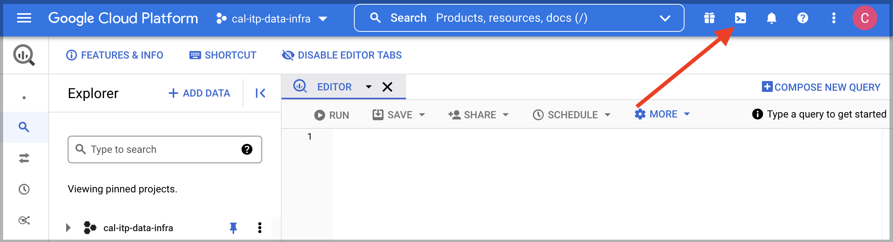

# Adding One-Off Datasets
To work with data in our BI tool ([Metabase](https://dashboards.calitp.org/)) we first have to add the data to our warehouse ([BigQuery](https://console.cloud.google.com/bigquery)). To add data to BigQuery for use in Metabase follow the instructions below.

*Not sure if you have the appropriate permissions to write tables in BigQuery?* Reach out to Charlie <a href="https://cal-itp.slack.com/team/U027GAVHFST" target="_blank">on Cal-ITP Slack using this link</a>.

When uploading data to the warehouse we will make use of the `uploaded_data` dataset in Big Query as our destination. To write data here we will first add the data to a Google Cloud Storage bucket and then input the command below in the BigQuery terminal.

1. First, upload your data to a [Google Cloud Storage](https://console.cloud.google.com/storage/browser/calitp-analytics-data) bucket and make note of the path.

2. Next, navigate to the Bigquery console in the GCP platform. From here you will select the terminal (shown in the image below).

3. Once in the terminal, input the following command with the appropriate structure:
```
bq --location=us-west2 load <source_format> --autodetect --allow_quoted_newlines <destination_table> <source>
```

* The `<source_format>` specifies the type of file you would like to use. An example of this flag's use is `--source-format=CSV`. Other options include `PARQUET` and `NEWLINE_DELIMITED_JSON`

* The `<destination_table>` is the table you would like to create, or append to if the table already exists. These tables should always be in the `uploaded_data` schema in BiGquery, and begin with `uploaded_data.`

* The `<source>` argument is the path to the Google Cloud Storage bucket you are sourcing from.

Ex.
```
bq --location=us-west2 load --source_format=CSV --autodetect --allow_quoted_newlines uploaded_data.tircp_with_temporary_expenditure_sol_copy gs://calitp-analytics-data/data-analyses/tircp/tircp.csv
```

If you are looking to create a new table:

If you are looking to append to existing data:

If you are looking to replace an existing table:

```{admonition} Looking for more information?
More information on the BigQuery Command Line Interface (CLI) [can be found here](https://cloud.google.com/bigquery/docs/reference/bq-cli-reference)
```
