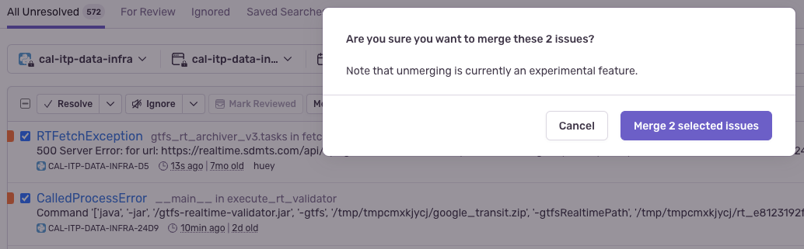
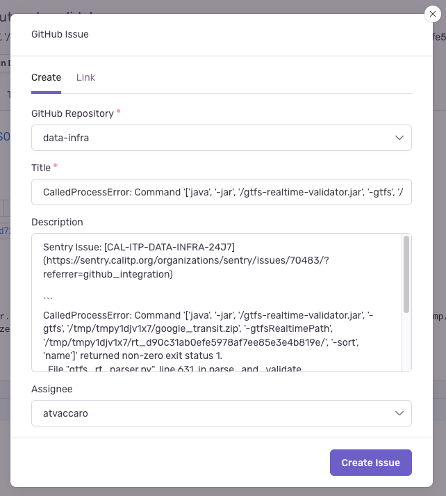

# Sentry triage
> Important Sentry concepts:
> * [Issue states](https://docs.sentry.io/product/issues/states-triage/)
> * [Fingerprinting and grouping](https://docs.sentry.io/product/sentry-basics/grouping-and-fingerprints/)
> * [Merging issues](https://docs.sentry.io/product/data-management-settings/event-grouping/merging-issues/)

Once a day, we should check Sentry issues created since the prior day, using the following query.

`is:unresolved firstSeen:-24h ` ([saved search link](https://sentry.calitp.org/organizations/sentry/issues/searches/3/?environment=cal-itp-data-infra&project=2&referrer=issue-list&sort=date&statsPeriod=24h))

Categorize those issues and perform relevant steps if the issue is not already assigned.

> When creating GitHub issues from Sentry, verify that no secrets or other sensitive information is contained in the generated issue body. Sentry's data masking is not perfect (and we may make a configuration mistake), so it's good to double-check.

### A fingerprinting error (i.e. too little or too much grouping)
This category primarily includes unhandled data processing exceptions (e.g. RTFetchException, CalledProcessError) whose fingerprint results in issues being improperly grouped together (for example, the same RTFetchException occurring on different feeds) or failing to be grouped together (for example, an exception message containing a Python object hash that is different in every exception instance).

* Too little grouping (i.e. too granular fingerprint)
    1. Merge the issues together. 
    2. Create a GitHub issue to update the fingerprint, linking to the now-merged issue.
* Too much grouping (i.e. too vague fingerprint)
    1. Create a GitHub issue to update the fingerprint, usually adding additional values to the fingerprint to distinguish between different errors.
    2. For example, you may want to split up an issue by feed URL, which would mean adding the feed URL to the fingerprint.
    3. When the new fingerprint has been deployed, _resolve_ the existing issue since it should no longer appear.

### Bug, or external issue handleable by retry
This category includes dbt test failures, Python/SQL code bugs, or external API calls that we are not retrying properly.

1. Create a GitHub issue to fix the bug (or add a retry) and assign if there is a clear owner.

2. In the eventual PR that should fix the issue, resolving the GitHub issue should also resolve the Sentry issue. You can also reference a Sentry issue to close directly via the PR description, e.g. `fixes CAL-ITP-DATA-INFRA-D5`.

### External, and a retry does not handle it
> e.g. SBMTD 500s in RT
No-op for now
