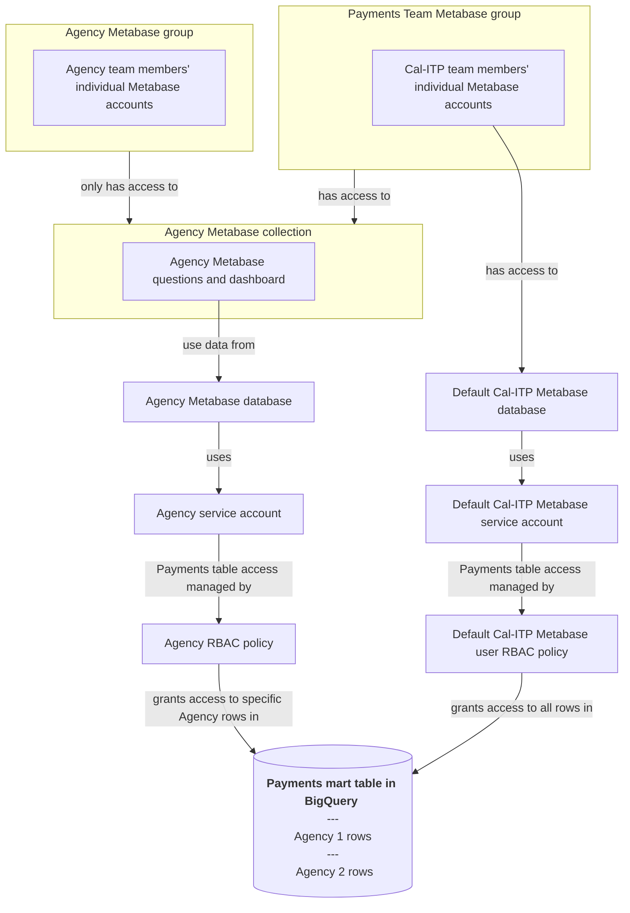

# Metabase: Configure Agency Payments Data and Generate Dashboards

This documentation is broken out into three sections:

- [Add a New Agency Data Source to Metabase and Create Permissions](#add-a-new-agency-data-source-to-metabase-and-create-permissions)
- [Create a New Agency Dashboard and the Comprising Questions](#create-a-new-agency-dashboard-and-the-comprising-questions)
- [Diagram: row-based security & Metabase](#diagram-row-based-security--metabase)

## Add a New Agency Data Source to Metabase and Create Permissions

As new agencies are introduced to the contactless payments program, we will need to access their data within Metabase for use in their payments dashboard and other analyses. Because we use a [row access policy](https://cloud.google.com/bigquery/docs/row-level-security-intro#how_row-level_security_works) ([configured here](https://github.com/cal-itp/data-infra/blob/main/warehouse/macros/create_row_access_policy.sql)) in the warehouse code to limit access to data to authorized parties, this is a multi-step process, and it begins with creating a new service account through our Terraform project.

### Create a new service account

**Permissions needed**:

- `Write` permissions to the (Cal-ITP `data-infra` repository)\[https://github.com/cal-itp/data-infra/tree/main\].

A new agency-specific service account needs to be created through the Terraform project in the `data-infra` repository. You can use (this previously-merged PR)\[https://github.com/cal-itp/data-infra/pull/4374/files\] as a reference for the two files that need to be modified through this process: `iac/cal-itp-data-infra/iam/us/project_iam_member.tf`, and `iac/cal-itp-data-infra/iam/us/service_account.tf`.

- To begin, create a new branch in the [cal-itp/data-infra Github repository](https://github.com/cal-itp/data-infra).
- Navigate to the first file to be modified: `iac/cal-itp-data-infra/iam/us/project_iam_member.tf`
  - Create a new entry in the file that mirrors the contents of the El Dorado service account configuration, (found here)\[https://github.com/cal-itp/data-infra/pull/4374/files#diff-225faaedb56a2d0c4b52f2a95e354a35444decb4cc6cff1717ce53b9d6e094fbR67-R71\].
  - Keep the majority of the contents of the El Dorado entry, subsituting only the `eldorado` text for a more appropriate naming convention based on the agency you are creating the service account for (this will be done in two places, lines 67 and 68 in the PR example above)
- Navigate to the second file to be modified: `iac/cal-itp-data-infra/iam/us/service_account.tf`
  - Create a new entry in the file that mirrors the contents of the El Dorado service account configuration, (found here)\[https://github.com/cal-itp/data-infra/pull/4374/files#diff-275fd84e89c5153d0616094b0a753a02143de7932dc96ca206a960a9bc6ef183R281-R285\].
  - Keep the majority of the contents of the El Dorado entry, subsituting only the `eldorao` portion of the `eldorado-payments-user` text for a more appropriate naming convention based on the agency you are creating the service account for (this will be done in two places, lines 218 and 282 in the PR example above)
- Once this has been completed, mark your PR as 'Ready for Review', and once approved by a reviewer, merge in your changes.
- Upon merge, and once the Github actions finish running successfully, your new service account will be available in the Google Cloud Platform. Navigate to `IAM &Admin` --> `Service Accounts` to verify.

### Create a new row access policy using the above service account

**Permissions needed**:

- Minimum Google Cloud Platform role `roles/iam.serviceAccountKeyAdmin` (more information can be found in the Google IAM documentation).
- `Write` permissions to the (Cal-ITP `data-infra` repository)\[https://github.com/cal-itp/data-infra/tree/main\].

1. Download the service account key for the service account you've just created

- After verifying that your new service account has been created in the list of existing service accounts, click into the service account that you just created.
- Select `Keys` from the top-center of the page and then select the `Add Key` dropdown. Choose the `Create new key` selection within that.
- Keep the default key type `JSON` and select `Create`
- This will download a JSON copy of the service accout key to your local environment, which will be used in later steps within Metabase. Store this in a secure, local location.

2. Open a new branch in the [cal-itp/data-infra Github repository](https://github.com/cal-itp/data-infra). You can use (this previously-merged PR)\[https://github.com/cal-itp/data-infra/pull/4376/files\] as a reference for the two dbt macros that need to be modified through this process in this file: `warehouse/macros/create_row_access_policy.sql`.

- Modify the first macro in the file: `payments_littlepay_row_access_policy`
  - Duplicate an existing entry. In the El Dorado example linked in the PR above, (this would be rows 89-93)\[https://github.com/cal-itp/data-infra/pull/4376/files#diff-e32013136795892ab542f0571294fd65e723bc4085e41b5a52ac75d29e3503e4R89-R93\].
  - Modify two fields:
    - Filter_value: substitute `'eldorado-transit'` with the **Littlepay participant_id** for the new agency.
    - Principals: Subsitute the address for the newly created service account after `['serviceAccount:`
- Modify the second macro in the file: `payments_elavon_row_access_policy`
  - Duplicate an existing entry. In the El Dorado example linked in the PR above, (this would be rows 184-188)\[https://github.com/cal-itp/data-infra/pull/4376/files#diff-e32013136795892ab542f0571294fd65e723bc4085e41b5a52ac75d29e3503e4R184-R188\].
  - Modify two fields:
    - Filter_value: substitute `'El Dorado County Transit Authority'` with the **Elavon organization_name** for the new agency.
    - Principals: Subsitute the address for the newly created service account after `['serviceAccount:`
- Once this has been completed, mark your PR as 'Ready for Review', and once approved by a reviewer, merge in your changes.
- Upon merge, and once the warehouse tables utilizing the row access polcies have been re-run, your new access policy will be in effect.

### Add a new `Database` in Metabase for the agency

**Permissions needed**: Member of the Metabase `Administrators` user group

This creates the limited-access connection to the BigQuery warehouse which allows Metabase to access the agency's payments data tables. In order to properly implement the previously-created row access policy within Metabase, each agency must have their own Metabase `Database`.

1. Navigate to Metabase, then `Settings`

- In the upper-right hand corner, select the `Settings` wheel icon. Within the dropdown, select `Admin settings`.
- In the top menu, select the `Databases` section to add a new databse
- Select `Add database` in the top-right. Replace the following information:
  - `Database type` --> BigQuery
  - `Display name` --> `Payments - [agency name]`
  - `Service account JSON file` --> upload the file downloaded in the previous section
  - `Datasets` --> `Only these...`
  - `Comma separated names of datasets that should appear in Metabase` --> `mart_payments`
- `Save` your changes

2. Add a new user `Group` for the agency and add users to the `Group`

This step will limit the users that can access the previously created database.

To begin, navigate to `People` in the top menu bar while within the `Admin settings` section

#### Create a new user `Group`

- Select `Groups` in the left-hand menu
- Select `Create a group` and input `Payments Group - [agency name]`

#### Add users to this new group

- **If they have already have Metabase user accounts**:
  - From within the `Groups` section, select the group that was just created
  - From there, select `Add members` from the top-right of the page
  - Type their name in the prompt, and once it auto-populates select `Add`
- **If they don't have Metabase user accounts**:
  - Select `People` in the left-hand menu
  - Select `Invite someone` from the top-right of the page
  - Populate `First name`, `Last name`, `Email`
  - In the `Groups` dropdown, select the new agency group that was just created

3. Create a new `Collection` for the agency

This is a folder for the agency within Metabase. We will store their payments dashboard and the questions that comprise it in this folder.

- From the previous step, select `Exit Admin` in the top right-hand corner to return to the Metabase homepage
  - Select `+ New` in the top right-hand corner
  - Select `Collection` from the drop-down
  - Input the name as `Payments Collection - [Agency Name]`
  - Collection it's saved in --> `Our Analytics` (the default)

4. Limit the access permissions on the new `Collection` by using the `Group` created in step #2

- Navigate back to `Settings --> Admin settings` in the upper right-hand corner of the page
  - Select `Permissions` from the top menu
  - Select `Collections` from the top left-hand side
  - Click on the payments collection that was just created in step #3
  - In the dropdown to the right of `Payments Group - [agency name]`, select `View`. This will allow the agency's users to view the dashboard and questions without breaking anything.
  - In the dropdown to the right of  `Payments Team`, select `Curate`. This will allow the internal team to manage the dashboard and questions.

Now, any questions or dashboards that you create within the collection will only be able to be viewed by the agency representatives that you added to the `Group`, and managed by the larger payments team within Cal-ITP.

## Create a New Agency Dashboard and the Comprising Questions

Relevant Metabase Concepts:

- `Question` - Individual visualizations
- `Dashboard` - Made up of `Question` and text tiles
- `Collection` - An agency-specific 'folder' within Metabase where agency `Dashboards` and `Questions` live.

Creation of collections and permissions groups are explained in the previous documentation section.

1. Duplicate an existing dashboard

The easiest way to create a new dashboard for an agency in Metabase is to duplicate an existing dashboard into the new agency's `Collection`. By duplicating the dashboard into the permission-protected collection, you are ensuring that only representatives from that agency (and internal staff) are able to view the data.

At this time there are two different types of agency dashboards: those that use flat fare formats, and those that use variable fare formats. There are currently none that use both. These differences impact a few questions within the dashboards, but the majority of the dashboards are the same.

*Some notable differences*:

- By nature, variable fare format dashboards include some additional questions
- Some dashboards have custom questions as requested by agencies
- Currently, one agency excludes certain questions (CCJPA doesn't include any `Form Factor` related questions due to only accepting one type)

**Good source dashboards for copying**:

- Contactless Payments Metrics Dashboard
  - **Flat Fare**: MST
  - **Variable Fare**: CCJPA
- Merchant Service Charge Tracking Dashboard
  - Mendocino Transit Authority

To duplicate a dashboard, navigate to the collection of one of the source dashboards above

- The dashboard should be pinned to the top of the collection, when hovering your cursor over the dashboard a menu icon should appear
- Select the menu icon, and choose `Duplicate` in the dropdown
- In the window that appears:
  - In the `Name` field, subsitute the name of the new agency in the parentheses and remove ` - Duplicate` which was automatically appended to the end
  - In the `Which collection should this go in` dropdown, select the Collection of the new agency
  - **DO NOT** select the `Only duplicate the dashboard` box, which is not selected by default
  - Select `Duplicate` to create the duplicate dashboard and questions

Like mentioned previously, Metabase Dashboards are comprised of `Questions` which serve as the visualizations in the dashboards. By not selecting the `Only duplicate the dashboard` box, the Questions will also be copied into the new agency's Collection along with the Dashboard during the duplication process.

2. Re-configuring the copied questions to use the correct `Database`

Duplicating an existing dashboard preserves much of the text, formatting, and settings of the dashboard -- and saves a lot of work as compared to creating a new dashboard from scratch. Unfortunately, within the duplicated questions there is a lot of re-configuring that must be done to switch the Questions to use the new agency's `Database` within Metabase -- created in the previous documentation section.

You will need to open every question in the new dashboard and change the source table used. This will reset all of the components of the `Question`, which will need to be re-implemented.

The easiest way to do this is to:

- Pull up the collection of the agency whose dashboard you initially duplicated and the new agency's collection side-by-side
- Go down the lists, opening up each question
- Change the Database and table name of the new agency's question to use the new agency's version of the Database and table, and then change the question's configuration to match the original question

Thankfully, question visualization configurations like visualization type (bar, line) and axis labels should be preserved.

**For SQL-based questions**

You will only need to change the name of the Database, but not the table name as it is explicit in the query. There is a dropdown above the query text where you can change the source Database to use the new agency's database.

For SQL-based questions you will also need to change the settings of the time filter from within the question:

- Navigate to edit the SQL-based question, and select the `Variables` icon to the right of the query text.
- From here, modify the variable settings:
  - `Variable Type` --> `Field Filter`
  - `Field to Map to` --> navigate to the table being used in the query (`FCT PAYMENTS RIDES V2`) and select the `On Transaction Date Time Pacific` field
  - `Filter widget type` --> `Date Filter`

Once you've re-configured the question you can press `Save`, selecting `Replace original question` when prompted (the default).

3. Configure the dashboard `Time Window` filter widget for the non-SQL-based questions

Once the questions are updated, the remaining step is to configure them to be filtered by the dashboard filter widget.

- Navigate to the dashboard, select the `Edit dashboard` icon in the top-right
- Select the settings wheel that appears next to the `Time Window` widget in the top-left of the dashboard
- This will cause a dropdown menu to display within all the Question tiles of the dashboard, except for SQL-based questions which have already had the filter applied in the previous step and will not have a drop-down menu displayed.
- Within the dropdowns, select `On Transaction Date Time Pacific` for all of the questions except the exceptions below
  - `Settlement Requested Date Time Utc` for:
    - `Total Revenue`
    - `Total Revenue by Day`
    - `Number of Settled Refunds, Grouped by Week`
    - `Value of Settled Refunds, Grouped by Week`
  - `Week Start` for:
    - `Journeys with Unlabeled Routes`

## Diagram: row-based security & Metabase

- [Row-based access control (RBAC) policies](https://github.com/cal-itp/data-infra/blob/main/warehouse/macros/create_row_access_policy.sql) define which rows users can access in a table
- Metabase uses service accounts to [connect](https://www.metabase.com/docs/latest/databases/connecting) to BigQuery; individual connections are called "databases" in Metabase
- [Metabase collections](https://www.metabase.com/glossary/collection) contain specific sets of [Metabase questions](https://www.metabase.com/glossary/question) and dashboards

