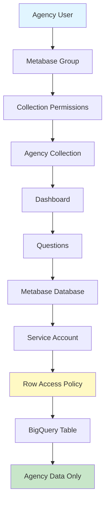

# Create Agency Metabase Dashboards

**Task:** Set up Metabase dashboards for a newly onboarded agency\
**Time Required:** 2-3 hours\
**Prerequisites:** Agency data pipeline configured, service account created, Metabase admin access

## Overview

This guide walks you through creating Metabase dashboards for an agency that has been onboarded to the payments ecosystem. You'll configure database connections, permissions, and duplicate/customize dashboards.

> **Note:** This is an enhanced version of the original documentation. Complete the [Littlepay onboarding](onboard-littlepay-agency.md) before starting this guide.

## Before You Start

### Prerequisites Checklist

Verify the following are complete:

- [ ] Agency's Littlepay data sync is configured and running
- [ ] Data appears in `mart_payments.fct_payments_rides_v2` for the agency
- [ ] Service account created (e.g., `<merchant-id>-payments-user@cal-itp-data-infra.iam.gserviceaccount.com`)
- [ ] Service account key JSON file downloaded
- [ ] Row access policies configured for the agency
- [ ] You have Metabase administrator access

### Information Needed

- [ ] Agency name (for display)
- [ ] Merchant ID / participant ID
- [ ] Service account key JSON file
- [ ] List of agency team members who need dashboard access
- [ ] Dashboard type needed (flat fare vs. variable fare)

## Step 1: Create Metabase Database Connection

Each agency needs a dedicated Metabase "Database" connection that uses their service account. This enforces row-level security.

### 1.1 Add Database

1. Log into [Metabase](https://dashboards.calitp.org) as administrator
2. Click Settings (gear icon) → **Admin settings**
3. Navigate to **Databases** tab
4. Click **Add database** (top right)

### 1.2 Configure Database

Fill in the following fields:

| Field                         | Value                                             |
| ----------------------------- | ------------------------------------------------- |
| **Database type**             | BigQuery                                          |
| **Display name**              | `Payments - <Agency Name>`                        |
| **Service account JSON file** | Upload the `<merchant-id>-payments-key.json` file |
| **Datasets**                  | Select "Only these..."                            |
| **Dataset names**             | `mart_payments`                                   |

**Important:**

- Display name format must be consistent: `Payments - <Agency Name>`
- Only include `mart_payments` dataset (not staging or external tables)
- Use the agency-specific service account, not the default Cal-ITP account

### 1.3 Save and Test

1. Click **Save**
2. Metabase will test the connection
3. Verify "Successfully saved!" message appears
4. Click on the database name to verify it shows `mart_payments` tables

## Step 2: Create Metabase Group

Groups control which users can access which collections and dashboards.

### 2.1 Navigate to Groups

1. In Admin settings, click **People** tab
2. Click **Groups** in the left sidebar
3. Click **Create a group**

### 2.2 Create Agency Group

1. **Group name:** `Payments Group - <Agency Name>`
2. Click **Create**

**Naming Convention:** Always use format `Payments Group - <Agency Name>` for consistency.

### 2.3 Add Members to Group

**For existing Metabase users:**

1. Click on the newly created group
2. Click **Add members** (top right)
3. Start typing the user's name
4. Select from dropdown
5. Click **Add**
6. Repeat for all agency team members

**For new users:**

1. Go back to **People** tab
2. Click **Invite someone** (top right)
3. Fill in:
   - **First name**
   - **Last name**
   - **Email**
4. In **Groups** dropdown, select `Payments Group - <Agency Name>`
5. Click **Create**
6. User will receive invitation email

## Step 3: Create Metabase Collection

Collections are folders that organize dashboards and questions.

### 3.1 Create Collection

1. Click **Exit admin** (top right) to return to main Metabase
2. Click **+ New** (top right)
3. Select **Collection**
4. **Name:** `Payments Collection - <Agency Name>`
5. **Collection it's saved in:** `Our Analytics` (default)
6. Click **Create**

### 3.2 Set Collection Permissions

1. Return to **Settings → Admin settings**
2. Click **Permissions** tab
3. Click **Collections** (left sidebar)
4. Find `Payments Collection - <Agency Name>` in the list
5. Set permissions:
   - **Payments Group - <Agency Name>:** `View`
   - **Payments Team:** `Curate`
   - **All Users:** `No access` (default)

**Permission Levels:**

- **View:** Can see and use dashboards/questions, cannot edit
- **Curate:** Can edit, create, and organize content
- **No access:** Cannot see the collection

## Step 4: Duplicate Dashboard

### 4.1 Choose Source Dashboard

Select an appropriate source dashboard based on the agency's fare structure:

**Flat Fare Agencies:**

- Source: MST's "Contactless Payments Metrics Dashboard"
- Use when: Single fixed fare per ride

**Variable Fare Agencies:**

- Source: CCJPA's "Contactless Payments Metrics Dashboard"
- Use when: Fare varies by distance, zones, or route

**Merchant Service Charge Tracking:**

- Source: Mendocino Transit Authority's dashboard
- Use for: Financial reconciliation and fee tracking

### 4.2 Duplicate Dashboard

1. Navigate to the source agency's collection
2. Find the dashboard (usually pinned at top)
3. Hover over dashboard → click **...** menu icon
4. Select **Duplicate**

### 4.3 Configure Duplication

In the duplication dialog:

1. **Name:** Update to new agency name
   - Example: `Contactless Payments Metrics Dashboard (MST)` → `Contactless Payments Metrics Dashboard (<New Agency>)`
2. **Which collection:** Select `Payments Collection - <Agency Name>`
3. **Only duplicate the dashboard:** **LEAVE UNCHECKED** ⚠️
   - This ensures questions are also duplicated
4. Click **Duplicate**

**Critical:** If you check "Only duplicate the dashboard," questions won't be copied and you'll have to recreate them manually.

## Step 5: Reconfigure Dashboard Questions

This is the most time-consuming step. Every question must be updated to use the new agency's database.

### 5.1 Open Both Collections Side-by-Side

**Recommended workflow:**

- Open source collection in one browser tab
- Open new agency collection in another tab
- Work through questions systematically

### 5.2 Reconfigure Each Question

For **each question** in the duplicated dashboard:

#### For GUI-Based Questions:

1. Open the question (click on it)
2. Click **Edit** (pencil icon, top right)
3. In the query builder:
   - **Database:** Change to `Payments - <New Agency>`
   - **Table:** Verify it's still `fct_payments_rides_v2` (or appropriate table)
4. Verify all fields are still selected correctly
5. Compare with source question to ensure configuration matches
6. Click **Save** → **Replace original question**

#### For SQL-Based Questions:

1. Open the question
2. Click **Edit**
3. Above the SQL query, find the **Database** dropdown
4. Change to `Payments - <New Agency>`
5. **Do not change the table name in the SQL** (it's explicit in the query)
6. Configure the time filter variable:
   - Click **Variables** icon (right of query)
   - For each variable:
     - **Variable Type:** `Field Filter`
     - **Field to Map to:** Navigate to table → select `On Transaction Date Time Pacific`
     - **Filter widget type:** `Date Filter`
7. Click **Save** → **Replace original question**

### 5.3 Questions Checklist

Track your progress through all questions. Typical dashboard includes:

**Metrics (Numbers):**

- [ ] Total Rides
- [ ] Total Revenue
- [ ] Average Fare
- [ ] Unique Riders

**Time Series:**

- [ ] Rides by Day
- [ ] Revenue by Day
- [ ] Rides by Week
- [ ] Revenue by Week

**Breakdowns:**

- [ ] Rides by Route
- [ ] Rides by Form Factor (card, phone, watch)
- [ ] Rides by Fare Type
- [ ] Revenue by Route

**Financial:**

- [ ] Settlement Status
- [ ] Refunds by Week
- [ ] Merchant Service Charges

**Data Quality:**

- [ ] Journeys with Unlabeled Routes
- [ ] Transaction Deltas

## Step 6: Configure Dashboard Filters

After reconfiguring all questions, set up the dashboard-level filters.

### 6.1 Edit Dashboard

1. Navigate to the duplicated dashboard
2. Click **Edit dashboard** (pencil icon, top right)

### 6.2 Configure Time Window Filter

The `Time Window` filter should already exist. Configure it to work with all questions:

1. Click the **gear icon** next to `Time Window` filter
2. For each question tile, a dropdown will appear
3. Select the appropriate field:
   - **Most questions:** `On Transaction Date Time Pacific`
   - **Settlement-related questions:** `Settlement Requested Date Time Utc`
   - **Weekly aggregations:** `Week Start`

**Specific Mappings:**

| Question                                   | Field to Map                       |
| ------------------------------------------ | ---------------------------------- |
| Total Revenue                              | Settlement Requested Date Time Utc |
| Total Revenue by Day                       | Settlement Requested Date Time Utc |
| Number of Settled Refunds, Grouped by Week | Settlement Requested Date Time Utc |
| Value of Settled Refunds, Grouped by Week  | Settlement Requested Date Time Utc |
| Journeys with Unlabeled Routes             | Week Start                         |
| All other questions                        | On Transaction Date Time Pacific   |

3. Click **Save** (top right)

## Step 7: Verify Dashboard

### 7.1 Test as Administrator

1. Set a date range (e.g., last 30 days)
2. Verify all visualizations load
3. Check for errors or "No results" messages
4. Verify numbers make sense (compare with BigQuery if needed)

### 7.2 Test as Agency User

1. Log out of admin account
2. Log in as an agency team member (or use incognito mode)
3. Navigate to `Payments Collection - <Agency Name>`
4. Open the dashboard
5. Verify:
   - [ ] Dashboard loads without errors
   - [ ] Data displays correctly
   - [ ] Filters work
   - [ ] Cannot see other agencies' collections
   - [ ] Cannot edit dashboard (only view)

### 7.3 Verify Row-Level Security

As agency user, try to create a new question:

1. Click **+ New** → **Question**
2. Select `Payments - <Agency Name>` database
3. Query `fct_payments_rides_v2`
4. Add filter: `participant_id` is not `<their-agency-id>`
5. Run query
6. **Expected result:** 0 rows (they can only see their data)

## Step 8: Pin Dashboard

Make the dashboard easily accessible:

1. In the collection, hover over the dashboard
2. Click **...** menu → **Pin this item**
3. Dashboard will appear at the top of the collection

## Troubleshooting

### Questions Show "No Results"

**Symptoms:** Questions load but show no data

**Solutions:**

- Verify database is set to agency-specific database
- Check row access policy includes the service account
- Confirm data exists in BigQuery for this agency
- Verify date filter range includes data

### Questions Show "Permission Denied"

**Symptoms:** Error message about permissions

**Solutions:**

- Verify service account has BigQuery user role
- Check row access policy is correctly configured
- Confirm service account key is valid
- Test service account access in BigQuery directly

### Filter Doesn't Work

**Symptoms:** Changing filter doesn't update visualizations

**Solutions:**

- Verify filter is mapped to correct field for each question
- Check SQL questions have variable configuration set
- Ensure field names match exactly (case-sensitive)

### Dashboard Shows Other Agencies' Data

**Symptoms:** Agency can see data from other agencies

**Solutions:**

- **Critical security issue!** Verify immediately
- Check database connection uses agency-specific service account
- Verify row access policy is correctly configured
- Test in BigQuery with service account credentials

### Questions Look Different from Source

**Symptoms:** Visualizations don't match source dashboard

**Solutions:**

- Compare question settings side-by-side with source
- Check visualization type (bar, line, pie, etc.)
- Verify axis labels and formatting
- Ensure all fields are selected correctly

## Dashboard Customization

### Adding Custom Questions

Agencies may request custom metrics:

1. Create new question in the collection
2. Use `Payments - <Agency Name>` database
3. Query `fct_payments_rides_v2` or other mart tables
4. Save to agency's collection
5. Add to dashboard

### Modifying Existing Questions

1. Edit the question
2. Make changes
3. Save as new question (don't replace original)
4. Add new question to dashboard
5. Remove old question from dashboard

### Dashboard Layout

1. Click **Edit dashboard**
2. Drag and resize tiles
3. Add text boxes for context
4. Group related visualizations
5. Save changes

## Related Documentation

- [Onboard a New Littlepay Agency](onboard-littlepay-agency.md)
- [Update Row Access Policies](update-row-access-policies.md)
- [Metabase Configuration Reference](../reference/metabase-config.md)
- [Data Security & Row-Level Access](../explanation/data-security.md)

## Diagram: Metabase Security Architecture

______________________________________________________________________

**See Also:** [Tutorial: Your First Agency Onboarding](../tutorials/03-first-agency-onboarding.md) for a complete walkthrough
