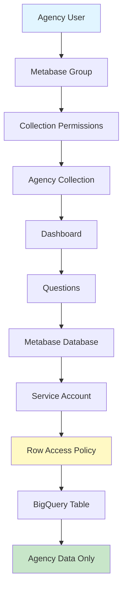

# Create Agency Metabase Dashboards

**Task:** Set up Metabase dashboards for a newly onboarded agency\
**Time Required:** 2-3 hours\
**Prerequisites:** Agency data pipeline configured, service account created, Metabase admin access

## Overview

This guide walks you through creating Metabase dashboards for an agency that has been onboarded to the payments ecosystem. You'll configure database connections, permissions, and duplicate/customize dashboards.

> **Note:** Complete the appropriate onboarding before starting this guide:
>
> - For fare collection: [Onboard a Littlepay Agency](onboard-littlepay-agency.md) OR [Onboard an Enghouse Agency](onboard-enghouse-agency.md)
> - For payment processing: [Onboard an Elavon Agency](onboard-elavon-agency.md)

## Before You Start

### Prerequisites Checklist

Verify the following are complete:

- [ ] Agency's fare collection data sync is configured and running (Littlepay or Enghouse)
- [ ] Data appears in `mart_payments.fct_payments_rides_v2` (Littlepay) or `mart_payments.fct_payments_rides_enghouse` (Enghouse) for the agency
- [ ] Service account created (e.g., `<agency-name>-payments-user@cal-itp-data-infra.iam.gserviceaccount.com`)
- [ ] Service account key JSON file downloaded
- [ ] Row access policies configured for the agency
- [ ] Payments entity mapping is configured for the agency
- [ ] You have Metabase administrator access

### Information Needed

- [ ] Agency name (for display)
- [ ] `participant_id` (Littlepay), `operator_id` (Enghouse), `customer_name` and `organization_name` (Elavon)
- [ ] Service account key JSON file
- [ ] List of agency team members who need dashboard access
- [ ] Dashboard type needed ( Littlepay vs. Enghouse, flat fare vs. variable fare)

## Step 1: Create Metabase Database Connection

Each agency needs a dedicated Metabase "Database" connection that uses their service account. This enforces row-level security.

### 1.1 Add Database

1. Log into [Metabase](https://dashboards.calitp.org) as administrator
2. Click Settings (gear icon) → **Admin settings**
3. Navigate to **Databases** tab
4. Click **Add database** (top right)

### 1.2 Configure Database

Fill in the following fields:

| Field                         | Value                                             |
| ----------------------------- | ------------------------------------------------- |
| **Database type**             | BigQuery                                          |
| **Display name**              | `Payments - <Agency Name>`                        |
| **Service account JSON file** | Upload the `<merchant-id>-payments-key.json` file |
| **Datasets**                  | Select "Only these..."                            |
| **Dataset names**             | `mart_payments`, `mart_benefits`                  |

**Important:**

- Display name format must be consistent: `Payments - <Agency Name>`
- Only include `mart_payments`and `mart_benefits` datasets (not staging or external tables)
- Use the agency-specific service account (upload the JSON file), not the default Cal-ITP account

### 1.3 Save and Test

1. Click **Save**
2. Metabase will test the connection
3. Verify "Successfully saved!" message appears
4. Click on the database name to verify it shows `mart_payments` and `mart_benefits` tables

## Step 2: Create Metabase Group

> **Why do this now?** We create the group before duplicating the dashboard to ensure proper permissions are in place from the start. This prevents unauthorized users from seeing agency data during the setup process.

Groups control which users can access which collections and dashboards.

### 2.1 Navigate to Groups

1. In Admin settings, click **People** tab
2. Click **Groups** in the left sidebar
3. Click **Create a group**

### 2.2 Create Agency Group

1. **Group name:** `Payments Group - <Agency Name>`
2. Click **Create**

**Naming Convention:** Always use format `Payments Group - <Agency Name>` for consistency.

### 2.3 Add Members to Group

**For existing Metabase users:**

1. Click on the newly created group
2. Click **Add members** (top right)
3. Start typing the user's name
4. Select from dropdown
5. Click **Add**
6. Repeat for all agency team members

**For new users:**

1. Go back to **People** tab
2. Click **Invite someone** (top right)
3. Fill in:
   - **First name**
   - **Last name**
   - **Email**
4. In **Groups** dropdown, select `Payments Group - <Agency Name>`
5. Click **Create**
6. User will receive invitation email

## Step 3: Create Metabase Collection

> **Why do this now?** We create the collection before duplicating the dashboard so there's a designated place to save the duplicated content. Without this, the dashboard would go to a default location and we'd have to move it later.

Collections are folders that organize dashboards and questions, and allow us to further enforce security.

### 3.1 Create Collection

1. Click **Exit admin** (top right) to return to main Metabase
2. Click **+ New** (top right)
3. Select **Collection**
4. **Name:** `Payments Collection - <Agency Name>`
5. **Collection it's saved in:** `Our Analytics` (default)
6. Click **Create**

### 3.2 Set Collection Permissions

1. Return to **Settings → Admin settings**
2. Click **Permissions** tab
3. Click **Collections** (left sidebar)
4. Find `Payments Collection - <Agency Name>` in the list
5. Set permissions:
   - **Payments Group - <Agency Name>:** `View`
   - **Payments Team:** `Curate`
   - **All Users:** `No access` (default)

**Permission Levels:**

- **View:** Can see and use dashboards/questions, cannot edit
- **Curate:** Can edit, create, and organize content
- **No access:** Cannot see the collection

## Step 4: Duplicate 'Contactless Payments Metrics Dashboard'

### 4.1 Choose Source Dashboard

Select an appropriate source dashboard based on whether the agency used Littlepay or Enghosue, and their fare structure:

**Littlepay - Flat Fare Agencies:**

- Source: MST's "Contactless Payments Metrics Dashboard"
- Use when: Single fixed fare per ride

**Littlepay - Variable Fare Agencies:**

- Source: CCJPA's "Contactless Payments Metrics Dashboard"
- Use when: Fare varies by distance, zones, or route

**Enghouse - Flat Fare Agencies:**

- Source: VCTC's "Contactless Payments Metrics Dashboard"

**Merchant Service Charge Tracking:**

- Source: Mendocino Transit Authority's dashboard
- Use for: Financial reconciliation and fee tracking

### 4.2 Duplicate Dashboard

1. Navigate to the source agency's collection
2. Find the dashboard (usually pinned at top)
3. Hover over dashboard → click **...** menu icon
4. Select **Duplicate**

### 4.3 Configure Duplication

In the duplication dialog:

1. **Name:** Update to new agency name
   - Example: `Contactless Payments Metrics Dashboard (MST)` → `Contactless Payments Metrics Dashboard (<New Agency>)`
2. **Which collection:** Select `Payments Collection - <Agency Name>`
3. **Only duplicate the dashboard:** **LEAVE UNCHECKED** ⚠️
   - This ensures questions are also duplicated. Questions are what power the dashboards.
4. Click **Duplicate**

**Critical:** If you check "Only duplicate the dashboard," questions won't be copied and you'll have to recreate them manually.

## Step 5: Reconfigure Dashboard Questions

This is the most time-consuming step. Every question must be updated to use the new agency's database.

### 5.1 Open Both Collections Side-by-Side

**Recommended workflow:**

- Open the source collection in one browser tab
- Open the new agency collection in another tab
- Work through questions systematically

### 5.2 Reconfigure Each Question

For **each question** in the duplicated dashboard:

#### For GUI-Based Questions:

1. Open the question (click on it)
2. Click **Edit** (pencil icon, top right)
3. In the query builder:
   - **Database:** Change to `Payments - <New Agency>`
   - **Table:** Verify it's still `fct_payments_rides_v2` (or appropriate table, `fct_payments_rides_enghouse` for Enghouse agencies)
4. Reconfigure the question contents based on the source question to ensure configuration matches
5. Click **Save** → **Replace original question**

#### For SQL-Based Questions:

1. Open the question
2. Click **Edit**
3. Above the SQL query, find the **Database** dropdown
4. Change to `Payments - <New Agency>`
5. **Do not change the table name in the SQL** (it's explicit in the query, and will be the same across databases)
6. Configure the time filter variable:
   - Click **Variables** icon (right of query)
   - For each variable:
     - **Variable Type:** `Field Filter`
     - **Field to Map to:** Navigate to table → select `On Transaction Date Time Pacific`
     - **Filter widget type:** `Date Filter`
7. Click **Save** → **Replace original question**

## Step 6: Configure Dashboard Filters

After reconfiguring all questions, set up the dashboard-level filters.

### 6.1 Edit Dashboard

1. Navigate to the duplicated dashboard
2. Click **Edit dashboard** (pencil icon, top right)

### 6.2 Configure Time Window Filter

The `Time Window` filter should already exist. Configure it to work with all questions:

1. Click the **gear icon** next to `Time Window` filter

2. For each question tile, a dropdown will appear

3. Select the appropriate field:

   - **Most questions:**
     - Littlepay: `On Transaction Date Time Pacific`
     - Enghouse: `Start DTTM`
   - **Settlement-related questions:** `Settlement Requested Date Time Utc`
   - **Weekly aggregations:** `Week Start`

4. Click **Save** (top right)

## Step 7: Verify Dashboard

### 7.1 Test as Administrator

1. Set a date range (e.g., last 30 days)
2. Verify all visualizations load
3. Check for errors or "No results" messages
4. Verify numbers make sense (compare with BigQuery if needed)
5. If you're seeing errors, and you just recently modified the dashboard date filter, try refreshing the page

### 7.2 Test as Agency User

1. Create a test user account. You can reuse this test account when onboarding future agencies, as long as you change the permission group applied to whatever agency you are working with.

- You can create a test user account by simply adding `+test` to your primary email account (ex. `sara@gmail.com` --> `sara+test@gmail.com`)
- This allows you to login in as a different user in Metabase, but still receive email notifications to your primary email address

2. Add the appropriate permission group (and only that permission group) to your new test user account in `Admin Settings` --> `People`
3. Log in as this new test user. When you log in, you should only see the database and collection for the agency that you are testing - you should not see any other databases, collections, questions, etc.
4. You should only be able to view the agency's collection, not edit

### 7.3 Verify Row-Level Security

1. Log in as your agency test user
2. Navigate to the agency's database, and open a mart table
3. You should only see data rows for that agency

## Step 8: Pin Dashboard

Make the dashboard easily accessible:

1. In the collection, hover over the dashboard
2. Click **...** menu → **Pin this item**
3. Dashboard will appear at the top of the collection

## Troubleshooting

### Questions Show "No Results"

**Symptoms:** Questions load but show no data

**Solutions:**

- Verify database is set to agency-specific database
- Check that you correctly added the service account JSON in database configuration
- Confirm data exists in BigQuery for this agency
- Verify date filter is applied correctly

### Questions Show "Permission Denied"

**Symptoms:** Error message about permissions

**Solutions:**

- Verify service account has BigQuery user role
- Check row access policy is correctly configured
- Confirm service account key is valid

### Filter Doesn't Work

**Symptoms:** Changing filter doesn't update visualizations

**Solutions:**

- Verify filter is mapped to correct field for each question
- Check SQL questions have variable configuration set

### Dashboard Shows Other Agencies' Data

**Symptoms:** Agency can see data from other agencies

**Solutions:**

- **Critical security issue!** Verify immediately
- Check database connection uses agency-specific service account
- Verify row access policy is correctly configured

### Questions Look Different from Source

**Symptoms:** Visualizations don't match source dashboard

**Solutions:**

- Compare question settings side-by-side with source template
- Check visualization type (bar, line, pie, etc.)
- Verify axis labels and formatting
- Ensure all fields are selected correctly

## Dashboard Customization

### Adding Custom Questions

Agencies may request custom metrics:

1. Create new question in the collection
2. Use `Payments - <Agency Name>` database
3. Create question from `fct_payments_rides_v2` or other mart tables
4. Save to agency's collection
5. Add to dashboard

### Modifying Existing Questions

1. Open the question
2. Make changes
3. Save as new question (replace original)

## Related Documentation

- [Update Row Access Policies](update-row-access-policies.md)

## Diagram: Metabase Security Architecture

______________________________________________________________________

**See Also:** [Tutorial: Your First Agency Onboarding](../tutorials/03-first-agency-onboarding.md) for a complete walkthrough
