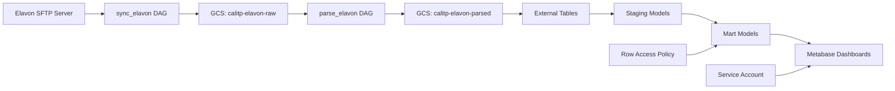

# Onboard a New Elavon Agency

**Task:** Configure Elavon payment processor data access for a new agency\
**Time Required:** 30-45 minutes\
**Prerequisites:** Agency already onboarded to Littlepay or Enghouse, service account created

## Overview

All Cal-ITP partner agencies use Elavon as their payment processor. Elavon handles the actual credit/debit card transactions and settlements. This guide walks you through adding Elavon data access for a newly onboarded agency.

**Important:** Elavon onboarding is typically done alongside Littlepay or Enghouse onboarding, as agencies need both fare collection AND payment processing data.

## Before You Start

### Prerequisites

- [ ] Agency has been onboarded to Littlepay OR Enghouse
- [ ] Service account created (e.g., `<agency-slug>-payments-user`)
- [ ] Elavon organization name confirmed
- [ ] Agency appears in Elavon's shared data feed

### Understanding Elavon Data

**Key Characteristics:**

- **Shared Data Feed:** All agencies' data comes through a single SFTP server
- **Organization-Based Filtering:** Data is filtered by organization name
- **No Per-Agency Credentials:** Unlike Littlepay, there are no agency-specific access keys
- **Sync Method:** Data is synced via `sync_elavon` DAG to GCS

**Elavon Data Tables:**

- Transactions
- Settlements
- Deposits
- Chargebacks
- Billing

## Step 1: Verify Agency in Elavon Data

First, confirm the agency's organization name appears in Elavon data.

### 1.1 Check Elavon Data

```sql
-- In BigQuery, check for the agency's organization name
SELECT DISTINCT organization_name
FROM `cal-itp-data-infra.external_elavon.transactions`
WHERE organization_name LIKE '%<Agency Name>%'
LIMIT 10;
```

**Note the exact organization name** - it must match exactly for row-level security to work.

### 1.2 Verify in Entity Mapping

The agency should already be in the entity mapping from Littlepay/Enghouse onboarding:

```bash
# Check the entity mapping file
cat warehouse/seeds/payments_entity_mapping.csv | grep -i "<agency-name>"
```

Or for Enghouse agencies:

```bash
cat warehouse/seeds/payments_entity_mapping_enghouse.csv | grep -i "<agency-name>"
```

The Elavon organization name should be in the 4th column.

## Step 2: Update Row Access Policy

Add the agency to the Elavon row access policy so their service account can access their data.

### 2.1 Edit Row Access Policy

Edit `warehouse/macros/create_row_access_policy.sql`:

Find the `payments_elavon_row_access_policy` macro and add a new entry:

```sql
UNION ALL
SELECT
  '<Elavon Organization Name>' AS filter_value,
  ['serviceAccount:<agency-slug>-payments-user@cal-itp-data-infra.iam.gserviceaccount.com'] AS principals
```

**Example:**

```sql
UNION ALL
SELECT
  'Monterey-Salinas Transit' AS filter_value,
  ['serviceAccount:mst-payments-user@cal-itp-data-infra.iam.gserviceaccount.com'] AS principals
```

**Critical:** The organization name must match EXACTLY as it appears in Elavon data (case-sensitive).

### 2.2 Commit Changes

```bash
git add warehouse/macros/create_row_access_policy.sql
git commit -m "Add <Agency Name> Elavon row access policy"
git push origin <your-branch>
```

Create a pull request, get it reviewed, and merge.

**Example PR:** <!-- TODO: Add link to example PR for Elavon row access policy -->

## Step 3: Verify Data Access

After the PR is merged and dbt models are rebuilt, verify the agency can access their Elavon data.

### 3.1 Check Elavon External Tables

```sql
-- Verify data exists for the agency
SELECT 
  organization_name,
  COUNT(*) as transaction_count,
  MIN(transaction_date) as earliest,
  MAX(transaction_date) as latest
FROM `cal-itp-data-infra.external_elavon.transactions`
WHERE organization_name = '<Elavon Organization Name>'
GROUP BY organization_name;
```

### 3.2 Check Staging Tables

```sql
-- Check staging layer
SELECT COUNT(*) 
FROM `cal-itp-data-infra.staging_elavon.transactions`
WHERE organization_name = '<Elavon Organization Name>';
```

### 3.3 Check Mart Tables

Elavon data appears in several mart tables:

```sql
-- Check Elavon-specific mart table
SELECT COUNT(*) 
FROM `cal-itp-data-infra.mart_payments.fct_elavon__transactions`
WHERE organization_name = '<Elavon Organization Name>';

-- Check reconciliation table (joins Littlepay/Enghouse with Elavon)
SELECT COUNT(*)
FROM `cal-itp-data-infra.mart_payments.elavon_littlepay__transaction_reconciliation`
WHERE elavon_organization_name = '<Elavon Organization Name>';
```

### 3.4 Verify Row-Level Security

Test that the service account can only access the agency's data:

```bash
# Authenticate as the service account
gcloud auth activate-service-account \
  --key-file=<agency-slug>-payments-key.json

# Query should return only this agency's data
bq query --use_legacy_sql=false \
  "SELECT organization_name, COUNT(*) as count 
   FROM \`cal-itp-data-infra.mart_payments.fct_elavon__transactions\` 
   GROUP BY organization_name"

# Should only show one organization_name (the agency's)
```

## Step 4: Update Metabase Dashboards

If the agency has Metabase dashboards, they may include Elavon data for financial reconciliation.

### 4.1 Revenue and Settlement Questions

Elavon data is used for:

- Total Revenue (from settlements)
- Settlement tracking
- Refund monitoring
- Merchant service charge tracking

### 4.2 Verify Dashboard Access

1. Log into Metabase as the agency user
2. Navigate to their payments dashboard
3. Check that settlement and revenue metrics display correctly
4. Verify no "permission denied" errors

## Troubleshooting

### No Data in Elavon Tables

**Symptoms:** Queries return 0 rows for the agency

**Solutions:**

- Verify organization name matches exactly (case-sensitive)
- Check that agency is actually in Elavon's data feed
- Confirm `sync_elavon` DAG is running successfully
- Check that `parse_elavon` DAG completed
- Verify external tables are pointing to correct GCS paths

### Row-Level Security Not Working

**Symptoms:** Service account can see other agencies' data

**Solutions:**

- Verify row access policy was added to macro
- Check organization name matches exactly in policy
- Confirm service account email matches exactly in policy
- Check dbt models were rebuilt after policy change
- Test with correct service account credentials

### Organization Name Mismatch

**Symptoms:** Data exists but row access policy doesn't work

**Solutions:**

- Query Elavon data to get exact organization name:
  ```sql
  SELECT DISTINCT organization_name 
  FROM `cal-itp-data-infra.external_elavon.transactions`
  ORDER BY organization_name;
  ```
- Update row access policy with exact name
- Update entity mapping if needed

### Data Reconciliation Issues

**Symptoms:** Littlepay/Enghouse data doesn't match Elavon data

**Solutions:**

- Check `elavon_littlepay__transaction_reconciliation` table
- Verify entity mapping links correct organizations
- Review settlement timing differences
- Check for refunds or chargebacks

## Understanding Elavon Data Flow



## Key Differences: Elavon vs. Littlepay/Enghouse

| Aspect             | Littlepay/Enghouse            | Elavon                                         |
| ------------------ | ----------------------------- | ---------------------------------------------- |
| **Data Source**    | Per-agency S3 buckets or GCS  | Shared SFTP server                             |
| **Identifier**     | participant_id / operator_id  | organization_name                              |
| **Credentials**    | Per-agency AWS keys           | Shared SFTP credentials                        |
| **Sync Frequency** | Hourly                        | Daily                                          |
| **Data Type**      | Fare collection (taps, trips) | Payment processing (transactions, settlements) |

## Related Documentation

- [Onboard a New Littlepay Agency](onboard-littlepay-agency.md)
- [Onboard a New Enghouse Agency](onboard-enghouse-agency.md)
- [Update Row Access Policies](update-row-access-policies.md)
- [Create Agency Metabase Dashboards](create-metabase-dashboards.md)

## Notes

**Elavon Onboarding Checklist:**

- [ ] Verify agency in Elavon data feed
- [ ] Confirm exact organization name
- [ ] Add to row access policy
- [ ] Commit and merge changes
- [ ] Wait for dbt rebuild
- [ ] Verify data access in BigQuery
- [ ] Test row-level security
- [ ] Verify Metabase dashboard access
- [ ] Document any issues

______________________________________________________________________
