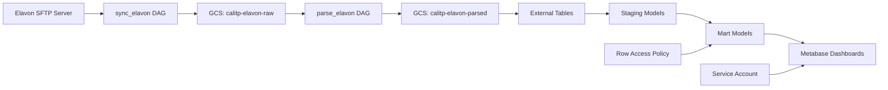

# Onboard a New Elavon Agency

**Task:** Configure Elavon payment processor data access for a new agency\
**Time Required:** 30-45 minutes\
**Prerequisites:** Agency already onboarded to Littlepay or Enghouse, service account created

## Overview

All Cal-ITP partner agencies currently use Elavon as their payment processor. Elavon handles the actual credit/debit card transactions and settlements. This guide walks you through adding Elavon data access for a newly onboarded agency.

**Important:** Elavon onboarding is typically done alongside Littlepay or Enghouse onboarding, as agencies need both fare collection AND payment processing data.

## Before You Start

### Prerequisites

- [ ] Agency has been onboarded to Littlepay OR Enghouse
- [ ] Service account created
- [ ] Elavon organization name confirmed
- [ ] Agency appears in Elavon's shared data feed

### Understanding Elavon Data

**Key Characteristics:**

- **Shared Data Feed:** All agencies' data comes through a single SFTP server
- **Organization-Based Filtering:** Data is filtered by `cutomer_name` in raw data, and either `customer_name` or `organization_name` in enriched mart tables downstream
- **No Per-Agency Credentials:** Unlike Littlepay, there are no agency-specific access credentials needed
- **Sync Method:** Data is synced via `sync_elavon` DAG to Elavon raw data bucket in GCS
- **Parse Method:** Data is parsed via `parse_elavon` DAG from raw data bucket to parsed data bucket

**Elavon Raw Data Tables:**

- `external_elavon.transactions`
  - One table for all batch types (Adjustments, Billing, Chargebacks, Deposits)

**Elavon Staging Data Table:**

- `stg_elavon__transactions`
  - One table for all batch types (Adjustments, Billing, Chargebacks, Deposits)

**Elavon Intermediate Data Tables:**
These tables break out the batch types into individual tables

- `int_elavon__adjustment_transactions`
- `int_elavon__billing_transactions`
- `int_elavon__chargeback_transactions`
- `int_elavon__deposit_transactions`

**Elavon Mart Data Tables:**
This table only contains Billing and Deposit batch types

- `fct_elavon__transactions`

**Revenue and Settlement Questions in Metabase**:

Elavon data is used for:

- Total Revenue
- Settlement tracking
- Refund monitoring
- Merchant service charge tracking

## Step 1: Verify Agency in Elavon Data

First, confirm the agency's `customer_name` appears in raw Elavon data.

### 1.1 Check Elavon Data

```sql
-- In BigQuery, check for the agency's customer name
SELECT DISTINCT customer_name
FROM `cal-itp-data-infra.external_elavon.transactions`
```

**Note the exact customer name** - it must match exactly for entity mapping to work.

### 1.2 Verify in Entity Mapping, or Add if not Yet Populated

The agency should already be in the entity mapping from Littlepay/Enghouse onboarding:

`warehouse/seeds/payments_entity_mapping.csv` for Littlepay agencies, or `warehouse/seeds/payments_entity_mapping_enghouse.csv` for Enghouse agencies

The Elavon `customer_name` should be in the 4th column. Add it if it is not already there.

## Step 2: Configure Row-Level Security

Row access policies ensure agencies only see their own data when querying through their service account. These policies are applied via post-hook in the tables in the **mart** layer.

### 2.1 Edit Row Access Policy

Edit `warehouse/macros/create_row_access_policy.sql`:

Find the `payments_elavon_row_access_policy` macro and add a new entry, using previous entries as a template:

**Example:**

```sql
{{ create_row_access_policy(
    filter_column = 'organization_name',
    filter_value = '<organization_name>',
    principals = ['serviceAccount:agency-payments-user@cal-itp-data-infra.iam.gserviceaccount.com']
) }};
```

**Critical:**

- The entity mapping uses the agency `organization_name` to filter in the row access policy (not `customer_name`) which becomes available in the data via enrichment in the mart tables, which is powered by the entity mapping seed file.
  - By using `organization_name` we are able to see the entire transaction history for agencies that have used different Elavon customer names over time.
- The organization name must match EXACTLY as it appears in the mart table data (case-sensitive).
- The service account name within `principals` must exactly match the name of the service account created during the Littlepay/Enghouse onboarding.

### 2.2 Commit Changes

Create a pull request, get it reviewed, and merge.

**Example PR:** \[#4696)(https://github.com/cal-itp/data-infra/pull/4696)\]

## Step 3: Verify Data Access

After all PRs are merged, actions have succeeded, and relevant DAGs have run, verify data flows through the pipeline.

### 3.1 Verify Sync DAG

After the data is expected to be made available from Elavon, and once the time of the next scheduled DAG run has passed:

1. Navigate to the Airflow UI
2. Find `sync_elavon` DAG, click into it
3. Ensure that the most recent run shows as a green 'success'.

### 3.2 Check Raw Data in GCS

1. Navigate to Google Cloud Storage
2. Select the bucket `calitp-elavon-raw`
3. You should see at least one zip file within that directory, ex: `gs://calitp-elavon-raw/ts=2023-07-28T00:00:09.900973+00:00/010PR001618FUND20230131.zip`

### 3.3 Verify Parse DAG

Once the time of the next scheduled sync DAG run has passed, and the time of the next scheduled parse DAG run has passed:

1. Navigate to the Airflow UI
2. Find `parse_elavon` DAG, click into it
3. Ensure that the most recent run shows as a green 'success'.

### 3.4 Check Parsed Data in GCS

1. Navigate to Google Cloud Storage
2. Select the bucket `calitp-elavon-parsed`
3. Select the directory `transactions/`
4. Select the directory of the agency whose sync task you are verifying, ex: `instance=mst/`
5. You should see recent date directories and zip files, ex: `calitp-elavon-parsed/transactions/dt=2023-07-29/execution_ts=2023-07-29T02:00:15.074963+00:00/transactions.jsonl.gz`

### 3.5 Verify External Tables

In BigQuery, query:

```sql
SELECT COUNT(*) as row_count
FROM `cal-itp-data-infra.external_elavon.transactions`
WHERE customer_name = '<elavon-customer-name>'
```

### 3.6 Verify dbt Transformations

After the next scheduled run of the transform_warehouse DAG:

```sql
-- Check staging table
SELECT COUNT(*) 
FROM `cal-itp-data-infra.staging.stg_elavon__transactions`
WHERE customer_name = '<elavon-customer-name>'

-- Check mart table
SELECT 
  COUNT(*) as total_transactions,
FROM `cal-itp-data-infra.mart_payments.fct_elavon__transactions`
WHERE customer_name = '<elavon-customer-name>'
```

## Step 4: Next Steps

After completing Littlepay onboarding:

1. **Set up Metabase dashboards:** Follow [Create Agency Metabase Dashboards](create-metabase-dashboards.md)
2. **Monitor the pipeline:** Use [Troubleshoot Data Sync Issues](troubleshoot-sync-issues.md) for ongoing monitoring

## Troubleshooting

### No Data in Elavon Tables

**Symptoms:** Queries return 0 rows for the agency

**Solutions:**

- Check that agency is actually in Elavon's data feed
- Confirm `sync_elavon` DAG is running successfully
- Check that `parse_elavon` DAG completed

### Row-Level Security Not Working

**Symptoms:** Service account can see other agencies' data

**Solutions:**

- Verify row access policy was added to macro
- Verify row access policy post-hook exists at the top of the table SQL that you're trying to protect
- Check dbt models were rebuilt after policy change
- Confirm service account email and `organization_name` filter match exactly in policy

### Data Reconciliation Issues

**Symptoms:** Littlepay/Enghouse data doesn't match Elavon data

**Solutions:**

- Check `elavon_littlepay__transaction_reconciliation` table
- Verify entity mapping links correct organizations
- Review pipeline schedule timing for mismatches (this could happen if a DAG schedule was modified)

## Understanding Elavon Data Flow



## Key Differences: Elavon vs. Littlepay/Enghouse

| Aspect             | Littlepay/Enghouse                  | Elavon                                         |
| ------------------ | ----------------------------------- | ---------------------------------------------- |
| **Data Source**    | Per-agency S3 buckets or GCS        | Shared SFTP server                             |
| **Identifier**     | participant_id / operator_id        | customer_name or organization_name             |
| **Credentials**    | Per-agency AWS keys, no credentials | Shared SFTP credentials                        |
| **Sync Frequency** | Hourly                              | Daily                                          |
| **Data Type**      | Fare collection (taps, trips)       | Payment processing (transactions, settlements) |

## Related Documentation

- [Onboard a New Littlepay Agency](onboard-littlepay-agency.md)
- [Onboard a New Enghouse Agency](onboard-enghouse-agency.md)
- [Update Row Access Policies](update-row-access-policies.md)
- [Create Agency Metabase Dashboards](create-metabase-dashboards.md)

______________________________________________________________________

**See Also:** [Tutorial: Your First Agency Onboarding](../tutorials/03-first-agency-onboarding.md) for general onboarding concepts
