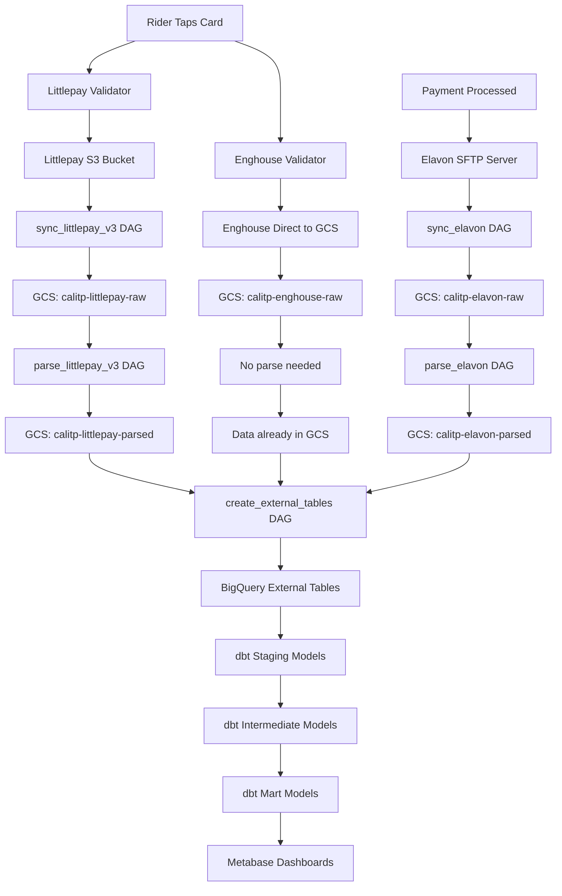

# Understanding the Data Flow

**Tutorial Duration:** ~45 minutes\
**Prerequisites:** [Getting Started with the Payments Ecosystem](01-getting-started.md)\
**What You'll Learn:** Deep dive into how data moves through the payments pipeline

## Introduction

In this tutorial, you'll gain a detailed understanding of how payments data flows from vendors through our pipeline to analytics tables. We'll follow actual data files, examine transformations, and understand the purpose of each step.

## The Complete Data Journey



## Part 1: Vendor Data Sources

### Littlepay Data Structure

Littlepay provides data through their AWS S3 buckets, with one bucket per agency (called an "instance" in our configs, or "participant" in the data).

**Key Tables Provided:**

- `device_transactions` - Every tap event (tap on, tap off)
- `micropayments` - Calculated fares for each trip
- `micropayment_adjustments` - Fare caps and discounts applied
- `aggregations` - Grouped micropayments ready for settlement
- `settlements` - Actual money transfers
- `customer_funding_source` - Payment methods (cards, phones)
- `products` - Fare products (day passes, fare caps, etc.)
- `terminal_device_transactions` - Terminal-specific transaction data

**File Format (Littlepay S3):**

```
eldorado-transit/v3/terminal-device-transactions/202601111103_terminaldevicetransactions.psv
```

**File Format (Our GCS Raw):**

```
gs://calitp-payments-littlepay-raw-v3/device-transactions/
  instance=eldorado-transit/
    filename=202601281105_devicetransactions.psv/
      ts=2026-01-28T12:01:47.458556+00:00/
        202601281105_devicetransactions.psv
```

**File Format (Our GCS Parsed):**

```
gs://calitp-payments-littlepay-parsed-v3/device-transactions/
  instance=eldorado-transit/
    extract_filename=202601281105_devicetransactions.psv/
      ts=2026-01-28T12:01:47.458556+00:00/
        202601281105_devicetransactions.jsonl.gz
```

Raw files are pipe-separated (.psv). Parsed files are converted to gzipped JSONL format, partitioned by instance, extract_filename, and sync timestamp.

### Enghouse Data Structure

Enghouse provides data directly to our GCS buckets via SFTP server (no intermediate vendor buckets to copy from).

**Key Tables Provided:**

- `taps` - Tap events (similar to Littlepay's device_transactions)
- `transactions` - Transaction/fare data (similar to Littlepay's micropayments)
- `pay_windows` - Payment window data
- `ticket_results` - Ticket/fare product results

**File Format (Enghouse GCS Raw):**

```
gs://cal-itp-data-infra-enghouse-raw/tap/ventura/VENTURA_TAPtaps-2026-01-28.csv
```

Data is delivered directly to GCS by Enghouse as CSV files. The schema differs significantly from Littlepay.

### Elavon Data Structure

Elavon provides data through an SFTP server with a single shared directory for all agencies.

**Data Provided:**

- Single file containing all transaction types, differentiated by `batch_type`:
  - 'B' = Billing transactions
  - 'C' = Chargeback transactions
  - 'A' = Adjustment transactions
  - 'D' = Deposit transactions

**File Format (Elavon Raw):**

```
gs://calitp-elavon-raw/ts=2026-01-28T00:00:33.636202+00:00/010PR001618FUND20260127.zip
```

**File Format (Elavon Parsed):**

```
gs://calitp-elavon-parsed/transactions/
  dt=2026-01-28/
    execution_ts=2026-01-28T02:33:15.654837+00:00/
      transactions.jsonl.gz
```

Files are pipe-separated text files inside zip archives, with all agencies' data mixed together. After parsing, they're separated by date and converted to JSONL. The different transaction types are separated downstream into transaction-specific files in the warehouse using the `batch_type` field.

## Part 2: Sync Stage - Raw Data Ingestion

**Note:** Enghouse data is delivered directly to our GCS buckets (`gs://calitp-enghouse-raw/`), so there is no sync DAG for Enghouse. The data appears directly in GCS and proceeds to the external tables stage.

### Littlepay Sync Process

**DAG:** `sync_littlepay_v3`\
**Schedule:** Hourly at :00 (`0 * * * *`)\
**Code:** `airflow/dags/sync_littlepay_v3/`

#### What Happens:

1. **Configuration Loading**

   - Each agency has a YAML config file (e.g., `mst.yml`)
   - Config specifies: instance, AWS credentials secret name, source bucket

2. **AWS Connection**

   - Retrieves AWS access key from Secret Manager
   - Connects to agency-specific S3 bucket
   - Uses boto3 to list and download files

3. **File Download**

   - Downloads all PSV files from S3
   - Preserves directory structure
   - Uploads to GCS with partitioning by instance, filename, and timestamp

4. **Partitioning**

   - Partitions by instance, filename, and sync timestamp
   - Allows tracking when data was synced
   - Enables historical replay if needed

**Example File Path:**

```
gs://calitp-payments-littlepay-raw-v3/device-transactions/
  instance=eldorado-transit/
    filename=202601281105_devicetransactions.psv/
      ts=2026-01-28T12:01:47.458556+00:00/
        202601281105_devicetransactions.psv
```

### Elavon Sync Process

**DAG:** `sync_elavon`\
**Schedule:** Daily at midnight (`0 0 * * *`)\
**Code:** `airflow/dags/sync_elavon/`

#### What Happens:

1. **SFTP Connection**

   - Connects using credentials from Secret Manager
   - Lists all files in `/data` directory

2. **Mirror Download**

   - Downloads entire directory contents
   - Preserves original file names and structure
   - Uploads to GCS with timestamp partition

3. **Full Snapshot**

   - Each run creates a complete snapshot
   - Allows point-in-time recovery
   - Files remain zipped at this stage

**Example File Path:**

```
gs://calitp-elavon-raw/ts=2026-01-28T00:00:33.636202+00:00/010PR001618FUND20260127.zip
```

## Part 3: Parse Stage - Format Conversion

### Why Parse?

BigQuery external tables work best with:

- JSONL (JSON Lines) format
- Gzipped compression
- Valid column names (no special characters)
- Consistent data types

Parsing converts vendor formats to BigQuery-compatible formats with minimal transformation.

### Littlepay Parse Process

**DAG:** `parse_littlepay_v3`\
**Schedule:** Hourly at :30 (`30 * * * *`) - runs 30 minutes after sync\
**Code:** `airflow/dags/parse_littlepay_v3/`

#### What Happens:

1. **Read Raw CSV**

   - Reads CSV from `calitp-littlepay-raw`
   - Uses pandas for parsing

2. **Minimal Transformations**

   - Rename columns with invalid characters (e.g., `transaction-id` → `transaction_id`)
   - Convert date strings to ISO format
   - Handle null values consistently
   - **No business logic changes**

3. **Write JSONL**

   - Convert each row to JSON object
   - Write one JSON object per line
   - Gzip the output
   - Upload to `gs://calitp-littlepay-parsed/`

**Example Transformation:**

CSV Input:

```csv
littlepay_transaction_id,transaction_time,participant_id,charge_amount
abc123,2024-01-15 10:30:00,mst,2.50
```

JSONL Output (gzipped):

```jsonl
{"littlepay_transaction_id":"abc123","transaction_time":"2024-01-15T10:30:00","participant_id":"mst","charge_amount":2.50}
```

### Elavon Parse Process

**DAG:** `parse_elavon`\
**Schedule:** Daily at 2:00 AM (`0 2 * * *`) - runs 2 hours after sync\
**Code:** `airflow/dags/parse_elavon/`

#### What Happens:

1. **Unzip Files**

   - Extracts pipe-separated text files from zips

2. **Parse Pipe-Separated Format**

   - Reads files with `|` delimiter
   - Handles quoted fields
   - Manages encoding issues

3. **Filter by Agency**

   - Identifies agency using organization name field
   - Separates mixed data into agency-specific files

4. **Write JSONL**

   - Converts to JSONL format
   - Gzips output
   - Uploads to `gs://calitp-elavon-parsed/`

## Part 4: External Tables - Making Data Queryable\*

**DAG:** `create_external_tables`\
**Schedule:** Hourly\
**Code:** `airflow/dags/create_external_tables/`

**\*Note:** This DAG only needs to run when table schemas change or new tables are added. It doesn't need to run for new data to appear - external tables automatically reflect new files in GCS.

### What Happens:

1. **Define Table Schema**

   - Defines BigQuery external table schemas
   - Points to GCS file locations using patterns
   - Specifies column names and types
   - Sets up partitioning
   - Uses appropriate format (JSONL for Littlepay/Elavon, CSV for Enghouse)

2. **Create/Update External Tables**

   - Creates or updates BigQuery external table definitions
   - **Does not scan or process the actual data**
   - Just defines how BigQuery should read files from GCS

3. **Result**

   - Data is queryable in BigQuery
   - No data is copied (external tables read directly from GCS)
   - New files automatically appear in queries without re-running this DAG
   - Tables appear in `external_littlepay_v3`, `external_elavon`, and `external_enghouse` datasets

## Part 5: dbt Transformations - Business Logic

**DAG:** `dbt_daily`\
**Schedule:** Daily (some models run more frequently)\
**Code:** `warehouse/models/`

### Staging Layer

**Location:** `warehouse/models/staging/`\
**Purpose:** Light cleaning and standardization

**Example: `stg_littlepay__device_transactions`**

- Casts data types correctly
- Renames columns to standard naming conventions
- Adds surrogate keys
- Filters out test data
- **Still one row per source row**

```sql
SELECT
  littlepay_transaction_id,
  CAST(transaction_time AS TIMESTAMP) AS transaction_time,
  participant_id,
  -- ... more columns
FROM {{ source('external_littlepay', 'device_transactions') }}
WHERE participant_id != 'test-account'
```

### Intermediate Layer

**Location:** `warehouse/models/intermediate/`\
**Purpose:** Joins, enrichments, complex logic

**Example: `int_payments__micropayments_adjustments_refunds_joined`**

- Joins micropayments with adjustments and refunds
- Combines related payment data
- Prepares data for final mart models

**Special Note: Littlepay Feed Version Union Tables**

A unique aspect of the Littlepay pipeline is handling the migration from older feed versions to v3. Some agencies started on Littlepay's older feed versions (v1/v2) and migrated to v3, while newer agencies started directly on v3. Feed v1 has been deprecated and is no longer provided. All agencies now use feed v3.

The intermediate layer includes union tables that combine historical v1 data with current v3 data:

- `int_littlepay__unioned_micropayments` - Unions v1 and v3 micropayments
- `int_littlepay__unioned_device_transactions` - Unions v1 and v3 device transactions
- `int_littlepay__unioned_settlements` - Unions v1 and v3 settlements
- And similar for other Littlepay tables

These union tables handle the cutover date logic (May 2025), using v1 data before migration and v3 data after, providing a seamless view of historical and current data for agencies that migrated.

### Mart Layer

**Location:** `warehouse/models/mart/payments/`\
**Purpose:** Final analytics-ready tables

**Key Mart Models:**

1. **`fct_payments_rides_v2`** - The main Littlepay rides fact table

   - One row per completed trip
   - Joins Littlepay micropayments with device transactions
   - Adds route, stop, and geographic information
   - Includes fare calculations and adjustments
   - **This is what Metabase dashboards query for Littlepay agencies**

2. **`fct_payments_rides_enghouse`** - The main Enghouse rides fact table

   - One row per completed trip
   - Enghouse tap and transaction data
   - **This is what Metabase dashboards query for Enghouse agencies**

3. **`fct_payments_aggregations`** - Settlement groupings

   - One row per aggregation (group of micropayments)
   - Used for financial reconciliation

4. **`fct_elavon__transactions`** - Payment processor transactions

   - One row per card transaction
   - Used for settlement verification

### Row-Level Security

Applied in mart models via post-hook:

```sql
{{ config(materialized = 'table',
    post_hook="{{ payments_littlepay_row_access_policy() }}") }}
```

This ensures agencies only see their own data when querying through their service account.

## Part 6: Metabase Visualization

### Connection Setup

Each agency has:

- Dedicated service account (e.g., `mst-payments-user@cal-itp-data-infra.iam.gserviceaccount.com`)
- Metabase "Database" connection using that service account
- Row-level security grants access based on:
  - `participant_id` for Littlepay agencies
  - `operator_id` for Enghouse agencies
  - Organization name for Elavon data

### Dashboard Queries

The questions that comprise the dashboards query various tables in `mart_payments`, including:

- `fct_payments_rides_v2` (Littlepay rides)
- `fct_payments_rides_enghouse` (Enghouse rides)
- `fct_payments_aggregations` (settlement data)
- `fct_elavon__transactions` (payment processor data)

Row-level security automatically filters to only the agency's data.

## Part 7: Hands-On Exercise

Let's trace a specific transaction through the entire pipeline! This exercise uses a Littlepay agency (MST) as an example, but the process is similar for Enghouse agencies (with different table and column names).

### Step 1: Find a Recent Transaction

In BigQuery, run:

```sql
SELECT 
  littlepay_transaction_id,
  participant_id,
  transaction_time,
  charge_amount
FROM `cal-itp-data-infra.mart_payments.fct_payments_rides_v2`
WHERE participant_id = 'mst'
ORDER BY transaction_time DESC
LIMIT 1;
```

Note the `littlepay_transaction_id` (e.g., `abc123xyz`).

### Step 2: Find in Staging

```sql
SELECT *
FROM `cal-itp-data-infra.staging.stg_littlepay__device_transactions_v3`
WHERE littlepay_transaction_id = 'abc123xyz';
```

Compare columns - notice the staging model has more raw fields.

### Step 3: Find in External Table

```sql
SELECT *
FROM `cal-itp-data-infra.external_littlepay.device_transactions`
WHERE littlepay_transaction_id = 'abc123xyz';
```

This queries the JSONL file directly from GCS.

### Step 4: Find the Raw File

In GCS Console:

1. Navigate to `calitp-littlepay-parsed`
2. Browse to `mst/device_transactions/`
3. Find the date partition matching your transaction
4. Download and examine the JSONL.gz file

### Step 5: Check Airflow Logs

In Airflow:

1. Go to `sync_littlepay_v3` DAG
2. Find the run that would have synced this transaction
3. Check logs to see the file being downloaded

## What You've Learned

You now understand:

- ✅ How vendor data is structured and accessed (Littlepay, Enghouse, Elavon)
- ✅ The sync process for Littlepay and Elavon (and why Enghouse doesn't need one)
- ✅ Why and how we parse data
- ✅ How external tables make data queryable
- ✅ The dbt transformation layers (staging, intermediate, mart)
- ✅ How row-level security works
- ✅ How Metabase connects and queries data
- ✅ How to trace a transaction through the entire pipeline

## Next Steps

1. **Practice onboarding**: Try [Your First Agency Onboarding](03-first-agency-onboarding.md)
2. **Deep dive on security**: Read [Data Security & Row-Level Access](../explanation/data-security.md)
3. **Explore the code**: Review [dbt Models Reference](../reference/dbt-models.md)

## Common Questions

**Q: Why not load data directly into BigQuery tables?**\
A: External tables preserve the raw data in GCS, allowing us to replay transformations without re-syncing from vendors. It also separates storage from compute.

**Q: Why do we need both sync and parse DAGs?**\
A: Sync preserves the exact vendor format. Parse converts to BigQuery-compatible format. This separation allows us to re-parse without re-syncing.

**Q: How long does data take to appear in dashboards?**\
A: Typically 2-3 hours: sync (hourly) → parse (hourly) → external tables (hourly) → dbt (daily, but some models run hourly).

**Q: What if a file is corrupted?**\
A: We can re-run the parse DAG for that specific partition without re-syncing from the vendor.

______________________________________________________________________

**Previous:** [← Getting Started](01-getting-started.md) | **Next:** [Your First Agency Onboarding →](03-first-agency-onboarding.md)
