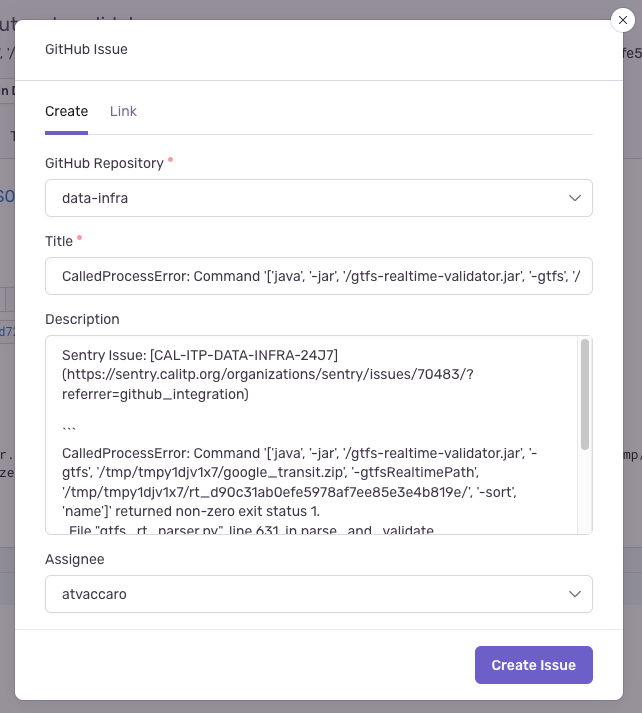
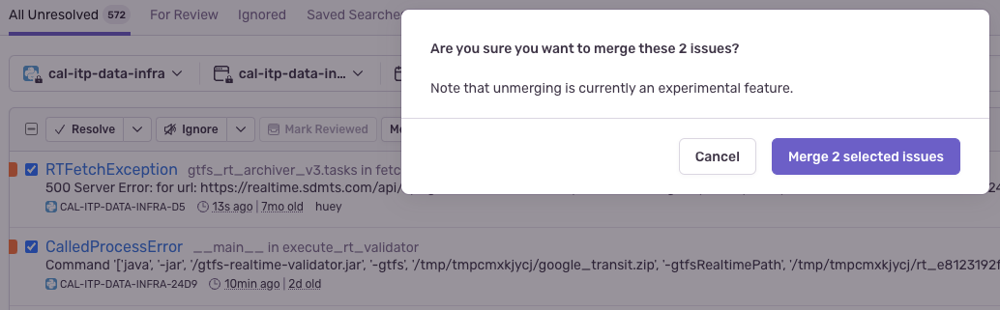

# Sentry triage

Sentry is a powerful tool for monitoring appliction errors and other targeted events in deployed services and sites. We self-host an instance of Sentry on Cal-ITP infrastructure, available [here](https://sentry.calitp.org/). To make use of the tool to its fullest extent, please read up on some important Sentry concepts:

> - [Issue states](https://docs.sentry.io/product/issues/states-triage/)
> - [Fingerprinting and grouping](https://docs.sentry.io/product/sentry-basics/grouping-and-fingerprints/)
> - [Merging issues](https://docs.sentry.io/product/data-management-settings/event-grouping/merging-issues/)

When we encounter a new application error in an application monitored by Sentry, an alert is generated in the #alerts-data-infra channel in the Cal-ITP Slack group. In addition to checking on those errors, it is valuable to regularly check Sentry for new and current issues, ideally daily. There are two separate things to check:

- All **new issues** from the past 24 hours. An issue is a top-level error/failure/warning, and a new issue represents something we have't seen before (as opposed to a new event instance of an issue that's been occurring for a while). These should be top priority to investigate since they represent net-new problems.

  - To identify: use the ["Daily Triage (new issues)" Issues search](https://sentry.calitp.org/organizations/sentry/issues/searches/5/?environment=cal-itp-data-infra&project=2)
  - The search criteria is: `is:unresolved firstSeen:-24h` on the [`Issues` page](https://sentry.calitp.org/organizations/sentry/issues/)
  - Note that this search will not identify regressions that are reappearing as "new"; regressions should appear on the observed events search noted below. You can also use the [`For Review` Issue search tab](https://sentry.calitp.org/organizations/sentry/issues/?environment=cal-itp-data-infra&project=2&query=is%3Aunresolved+is%3Afor_review) to check for regressions.

- All **observed events** from the past 24 hours. An event is an instance of an issue, so these may not be *new* but we want to monitor all currently-active errors. For this monitoring we suppress some of the noisy `RTFetchException` and `CalledProcessError` events that tend to happen intermittently most days.

  - To identify: use the ["Daily triage (all events)" Discover search](https://sentry.calitp.org/organizations/sentry/discover/results/?environment=cal-itp-data-infra&id=1&project=2&statsPeriod=24h)
  - The search criteria is: `event.type:error (!message:RTFetchException OR count > 15) (!message:CalledProcessError OR count > 1) (!message:DbtTestWarn)` on the [`Discover` page](https://sentry.calitp.org/organizations/sentry/discover/queries/)

Categorize the issues/events identified and perform relevant steps if the issue is not already assigned (particularly for the second search, existing issues may already be assigned so you may not need to do anything new).

## GitHub issues

Sentry includes push-button functionality to generate GitHub issues directly from a Sentry issue page. When creating GitHub issues from Sentry:

- Verify that no secrets or other sensitive information is contained in the generated issue body. Sentry's data masking is not perfect (and we may make a configuration mistake), so it's good to double-check.

- Clean up the issue so that someone looking at it later will understand what the error actually is. The auto-generated issues produced by Sentry will only contain the exception text and a link back to Sentry; making a more human-friendly issue title and description is helpful.

## Issue types

Most issues fall into a few broad categories.

### External, and a retry does not handle it (most common)

This category includes external issues that a retry cannot resolve. For example, an RT feed that intermittently throws 500s. For RT fetch issues specifically:

- *If the issue occurred \<10 times:*  Do nothing (don't "ignore" or "resolve" in Sentry, just leave the issue as-is.)
- *If the issue occurred more than 10 times:* Check the [feed-level Metabase dashboard](https://dashboards.calitp.org/dashboard/112-feed-level-v2?date_filter=past3days~&text=Bay%20Area%20511%20Regional%20Alerts&text=Bay%20Area%20511%20Regional%20TripUpdates&text=Bay%20Area%20511%20Regional%20VehiclePositions) to see whether it seems like the feed has had a sustained outage. If they have had an outage lasting more than 6 hours, plan to check again the following day. Once a feed has been down for a full 24 hours we should notify a relevant customer success manager to monitor and, if the outage lasts long enough, consider contacting the agency.

### Bug, or external issue handleable by retry

This category includes dbt test/model failures/errors, Python/SQL code bugs, or external API calls that we are not retrying properly.

1. Create a GitHub issue to fix the bug (or add a retry) and assign if there is a clear owner.

2. In the eventual PR that should fix the issue, resolving the GitHub issue should also resolve the Sentry issue. You can also reference a Sentry issue to close directly via the PR description, e.g. `fixes CAL-ITP-DATA-INFRA-D5`.

### A fingerprinting error (i.e. too little or too much grouping)

This category primarily includes unhandled data processing exceptions (e.g. RTFetchException, CalledProcessError) whose fingerprint results in issues being improperly grouped together (for example, the same RTFetchException occurring on different feeds) or failing to be grouped together (for example, an exception message containing a Python object hash that is different in every exception instance).

- Too little grouping (i.e. too granular fingerprint)
  1. Merge the issues together. 
  2. Create a GitHub issue to update the fingerprint, linking to the now-merged issue.
- Too much grouping (i.e. too vague fingerprint)
  1. Create a GitHub issue to update the fingerprint, usually adding additional values to the fingerprint to distinguish between different errors.
  2. For example, you may want to split up an issue by feed URL, which would mean adding the feed URL to the fingerprint.
  3. When the new fingerprint has been deployed, _resolve_ the existing issue since it should no longer appear.
